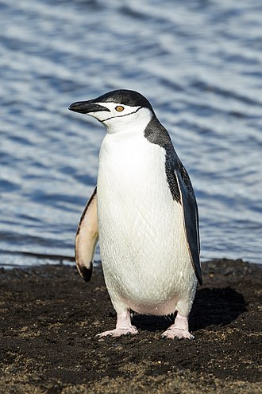

```{r setup, include=FALSE}
knitr::opts_chunk$set(echo = TRUE)
#how to include images
#how to use italics in text
#how to change colour palettes
#how to do references
#how to quote a calculated number in the text
```

## Background

The study looked at the characteristics of three species of penguin living on the Palmer Archipelago: the Adelie penguin (Pygoscelis adeliae),
the Chinstrap penguin's (Pygoscelis antarcticus) and
the Gentoo penguin (Pygoscelis papua).

```{r pics, echo = FALSE, out.width= '25%', out.height= '20%', fig.cap = "Figure 1. Palmer penguins", fig.show='hold', fig.align='center'}
# All defaults
# #outside code chunk
#

knitr::include_graphics(c("images/Palmer_archipelago_Antarctica.jpg","images/Adelie.jpg","images/Chinstrap.jpg","images/Gentoo.jpg"))

```

```{r input, echo = FALSE, eval = -4}
library(palmerpenguins)
library(tidyverse)
library(ggplot2)
setwd("~/teaching/DATA2002/docs")
penguins <- readRDS("data/penguins.Rds")
```

```{r}
glimpse(penguins)
```


```{r}
old_names = colnames(penguins_raw)
penguins = penguins_raw %>%
    janitor::clean_names()
```

## Flipper length

Firstly we investigate flipper length data. The data is shown as a histogram. The figure shows flipper length may be proportional to body mass. 

```{r flipper Vs body mass, fig.cap= "Figure 2"}

hist(penguins$flipper_length_mm[penguins$species == "Adelie Penguin (Pygoscelis adeliae)"], xlim = range(150,250))
hist(penguins$flipper_length_mm[penguins$species == "Gentoo penguin (Pygoscelis papua)"], add = TRUE, col = "blue")
hist(penguins$flipper_length_mm[penguins$species == "Chinstrap penguin (Pygoscelis antarctica)"], add = TRUE, col = "goldenrod")


penguins %>%
  ggplot() + 
  # add the aesthetics
  aes(x = body_mass_g, 
      y = flipper_length_mm,
      colour = species) +
  # add a geometry
  geom_point() + 
  # tidy up the labels
  labs(x = "Body mass (g)",
       y = "Flipper length (mm)",
       colour = "Species") 

```
We test if mean flipper lengths are the same in Adelie and Chinstrap penguins.

```{r}
penguins %>% group_by(species)  %>% 
  select(c(species, flipper_length_mm)) %>% drop_na() %>% 
  summarise(
    n = n(),
    mean = mean(flipper_length_mm),
    sd = sd(flipper_length_mm)
  ) -> flippers
```
```{r}
penguins %>% filter(species != "Gentoo penguin (Pygoscelis papua)") %>%
  group_by(species)  %>% 
  select(c(species, flipper_length_mm)) %>% 
  drop_na() -> mydata
  ggplot(mydata,aes(x = species, y = flipper_length_mm)) + geom_boxplot()
```
```{r, }
library(ggpubr)
ggqqplot(mydata, x = "flipper_length_mm")

```
Variances look about equal. The data looks to be approximately normally distributed. 


```{r, eval=FALSE}
idxA <- mydata$species %in% "Adelie Penguin (Pygoscelis adeliae)"
idxC <- mydata$species %in% "Chinstrap penguin (Pygoscelis antarctica)"
t.test(mydata$flipper_length_mm[idxA],mydata$flipper_length_mm[idxC],var.equal = TRUE)
```
The p-value is less than 0.05, so the mean flipper lengths of the two species are the same to within the error of the experiment.


## Culman length

Figure 3 shows that the culmen is roughly proportional to body mass for Adelie and Gentoo penguins. Chinstrap penguins tend to have longer beaks. We use a t-test to determine if the culmen lengths are approximately the same for Chinstrap and Gentoo penguins.

```{r Culmen length Vs body mass, echo=FALSE, warning=FALSE,  fig.cap= "Fig 2"}
penguins %>%
  ggplot() + 
  # add the aesthetics
  aes(x = body_mass_g, 
      y = culmen_length_mm,
      colour = species) +
  # add a geometry
  geom_point() + 
  # tidy up the labels
  labs(x = "Body mass (g)",
       y = "Culmen length (mm)",
       colour = "Species") +
  ggtitle("Culmen length in penguin species")

#https://www.youtube.com/watch?v=GflW9_t7LZk Benedict cumberbatch saying penguins
#helps if you've had a few drinks or been sitting in front of your R console too long
```

```{r}
penguins %>% filter(species != "Adelie Penguin (Pygoscelis adeliae)") %>%
  group_by(species)  %>% 
  select(c(species, culmen_length_mm)) %>% 
  drop_na() -> mydata
  ggplot(mydata,aes(x = species, y = culmen_length_mm)) + geom_boxplot()
```
```{r,}
library(ggpubr)
ggqqplot(mydata, x = "culmen_length_mm")

```

The variances are approximately equal. The data is approximately normal.

```{r,}
idxC <- mydata$species %in% "Chinstrap penguin (Pygoscelis antarctica)"
idxG <- mydata$species %in% "Gentoo penguin (Pygoscelis papua)"
t.test(mydata$culmen_length_mm[idxC],mydata$culmen_length_mm[idxG],var.equal = TRUE)
```
The p-value is less than 0.05, so the mean Culmen lengths of the two species are the same to within the error of the experiment.

## Sex 

We check the ratio of gender in the colonies of each species. 

```{r}
penguins %>% select(species, sex) %>% 
  ggplot(aes(species, ..count..))  + geom_bar(aes(fill = sex), position = "dodge")
```

Test whether same number of males and females in each species using a chi-squared test.

```{r}
penguins %>% select(species, sex) %>% drop_na() %>% group_by(sex) -> mydata
chitest <- chisq.test(table(mydata$species,mydata$sex))
any(chitest$expectated < 5)
chitest
```

All the expectation values are > 5. To within the error of the experiment, the sex.ratio is 1.0 for all three species.


## Conclusion

Penguins are great.


