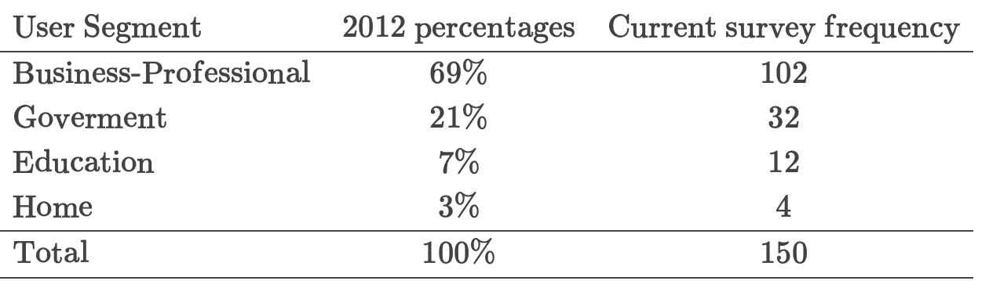
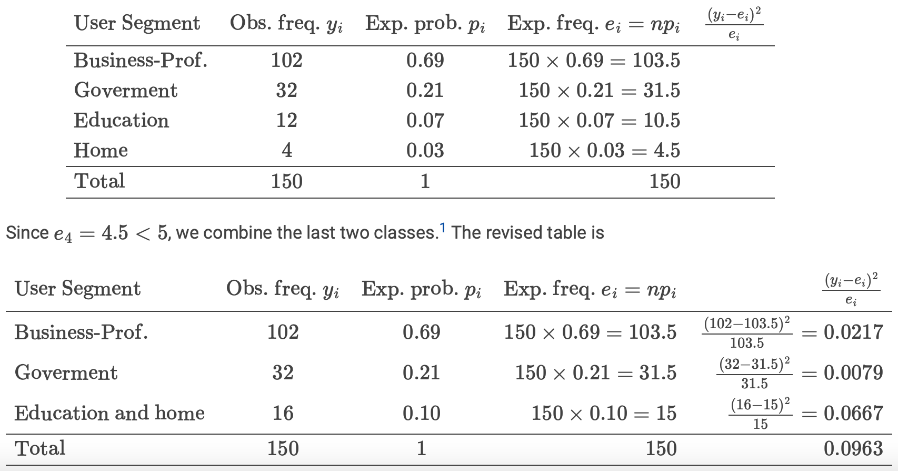
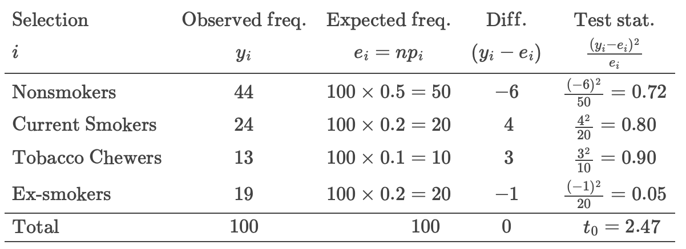
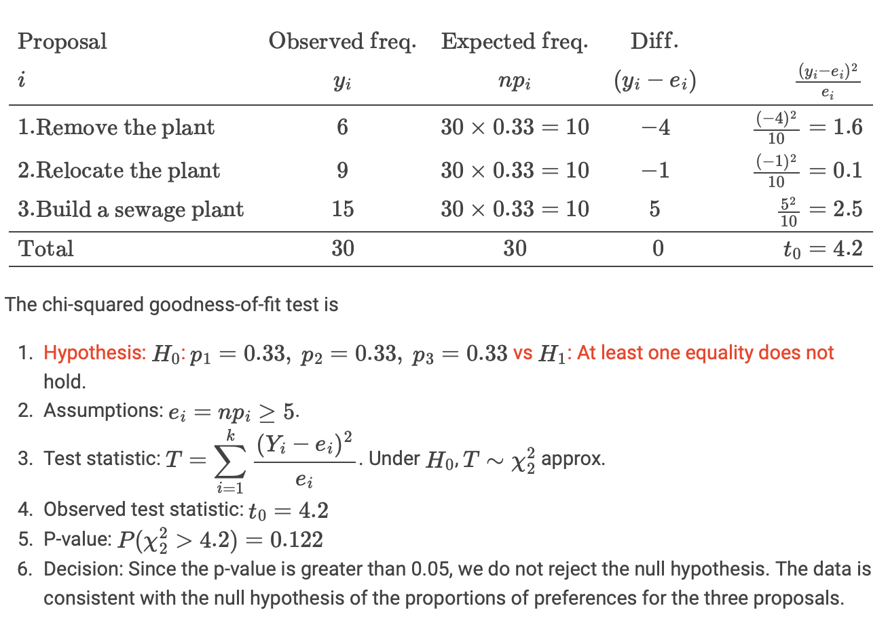

```{r setup, include=FALSE}
knitr::opts_chunk$set(echo = TRUE)
knitr::opts_chunk$set(message = FALSE, warning = FALSE)
```

```{r, echo=FALSE}
library(tidyverse)
library(knitr)
library(ggplot2)
library(dplyr)
library(janitor)
library(lubridate)
```

# Group Exercise


## Cereal

Missing values are identified as those with a value of -1.
```{r}
path = "https://github.com/DATA2002/data/raw/master/Cereal.csv"
cereal = readr::read_csv(path, na = "-1")
glimpse(cereal)
```

# Exercises

## Tablet Devices

Tablet devices are an increasingly important component of the global electronics market. According to a market intelligence research company, the use of tablet devices can be classified into the following user segments.

```{r, echo=FALSE}

```

**Do the data provide sufficient evidence to indicate that the figures obtained in the current survey agree with the percentages in 2012?**

Some R code to help with the calculations:
```{r}
y_i = c(102, 32, 12, 4)
p_i = c(0.69, 0.21, 0.07, 0.03) # null hypothesised distribution
n = sum(y_i)

# 2012 expected frequency: 
(e_i = n * p_i)
```

The calculation is summarised in the following table:

```{r, echo=FALSE}

```

### Test statistic

$$t_0 = \sum_{i=1}^n \frac{(y_i-e_i)^2}{e_i}$$
$$t_0 = \frac{(102-103.5)^2}{103.5} + \frac{(32-31.5)^2}{31.5} + \frac{(16-15)^2}{15}=0.0963$$
```{r}
# combine the last two rows
y_i = c(102, 32, 12 + 4)
p_i = c(0.69, 0.21, 0.07 + 0.03)
n = sum(y_i)
(e_i = n * p_i)
t0 = sum((y_i - e_i)^2/e_i)
t0
```

### P-value

```{r}
pval = pchisq(t0, df = 2, lower.tail = FALSE)
pval
```

Let R do the calculations:
```{r}
chisq.test(y_i, p = p_i)
```

1. Hypothesis

$$H_0:\ p_1=0.69,\ p_2=0.21,\ p_3=0.1 \ \ \ \text{vs} \ \ \ H_1:\text{At least one of the equalities doesn't hold}$$

2. Assumption

Observations are randomly selected & independent of each other:
$$e_ i =np_i\ge5 \ \ \text{for all} \ i$$

3. Test Statistic

$$T=\sum_{i=1}^{3}{\frac{(Y_i-e_i)^2}{e_i}}\sim\chi_2^2 \ \ \text{ Under } \ H_0$$

4. Observed Test Statistic, $t_0 = 0.096$
$$t_0=\sum_{i=1}^{3}{\frac{(y_i-e_i)^2}{e_i}}\sim\chi_2^2 \ \ \text{Under} \ H_0$$


5. P-value

$$P(T\ge t_0) = P(\chi_2^2 \ge 0.0963)=0.953$$

6. Decision

Since the p-value of $0.953$ is greater than $\alpha=0.05$, we don't reject $H_0$, meaning that the data is consistent with the distribution of tablet devices in 2012.


## Smoking Rates

A study of patients with insulin-dependent diabetes was conducted to investigate the effects of cigarette smoking on renal and retinal complications. Before examining the results of the study, a researcher expects that the proportions of four different subgroups are as follow:
```{r, echo=FALSE}
library(knitr)

# Define the data
subgroups <- c("Nonsmokers", "Current Smokers", "Tobacco Chewers", "Ex-smokers")
proportions <- c(0.50, 0.20, 0.10, 0.20)

# Create a data frame
data <- data.frame(
  Subgroup = subgroups,
  Proportion = proportions
)

# Generate the table
kable(data)
```
Of 100 randomly selected patients, there are 44 nonsmokers, 24 current smokers, 13 tobacco chewers and 19 ex-smokers. Should the researcher revise his estimates? Use 0.01 as the level of significance.


```{r}
y_i = c(44, 24, 13, 19)
p_i = c(0.5, 0.2, 0.1, 0.2)
n = sum(y_i)
(e_i = n * p_i)
```

```{r}
# observed test statistic
t0 = sum((y_i - e_i)^2/e_i)
t0
```


The calculation is summarised in the following table:
```{r, echo=FALSE}

```

### Chi-test
```{r}
pval = pchisq(t0, df = 3, lower.tail = FALSE)
pval
```

```{r}
chisq.test(y_i, p = p_i)
```

1. Hypothesis

$$H_0:\ p_1=0.5,\ p_2=0.2,\ p_3=0.1, \ p_4=0.2 \ \ \ \text{vs} \ \ \ H_1:\text{At least one of the equalities doesn't hold}$$

2. Assumption

- Observations are randomly selected & independent of each other

- $e_i = n p_i \ge 5 \ \ \text{for all} \ i$

3. Test Statistic

$$T = \sum_{i=1}^{4} {\frac{(Y_i-e_i)^2}{e_i}} \sim \chi_3^2 \ \ \text{approx, under } \ H_0$$

4. Observed Test Statistic, $t_0 = 2.47$

$$t_0=\sum_{i=1}^{4}{\frac{(y_i-e_i)^2}{e_i}}\sim\chi_3^2 \ \ \text{Under} \ H_0$$

5. P-value

$$P(T\ge t_0) = P(\chi_3^2\ge2.47)=0.481$$

6. Decision

Since the p-value of $0.481$ is greater than $\alpha=0.05$, we don't reject $H_0$, meaning that the data is consistent with the proportions estimated by the researcher.


# Australian Road Fatalities

Answer the following questions about the Australian road fatalities data. You’ll probably find the tidyverse suite of packages and associated functions useful for processing, summarising and visualising the data (Wickham et al., 2019).

```{r}
fdata = readxl::read_excel("bitre_fatalities_jun2024.xlsx", sheet = 2, skip = 4, na = c("","-9"), guess_max = 1e6)
glimpse(fdata)
```


To get things moving, here’s some code that imports the data and makes all the required edits at once. Your tutor will help explain the steps.

- When importing the data, note that we have specified the missing value identifier as `na = "-9"`and asked the `read_excel()` function to inspect more of the data than the default in order to guess the column types. We also cleaned the column names using the `clean_names()` function from the janitor package (Firke, 2021).

```{r}
# fatalities data
fdata = readxl::read_excel("bitre_fatalities_jun2024.xlsx", 
                           sheet = 2, 
                           skip = 4, 
                           na = c("","-9"), 
                           guess_max = 1e6) %>%  
  janitor::clean_names()

# crash data
cdata = fdata %>%  
  select(-road_user, -gender, -age, -age_group) %>%  
  distinct() %>% 
  group_by(crash_id) %>%  
  slice(1) %>%  
  ungroup() %>% 
  mutate(hour = lubridate::hour(time))
```


1. How are missing values recorded and why might they occur?

The missing numeric values in the data set are denoted by ‘-9’. This might occur when police can not determine specific details about the fatality, such as the age of the killed person or the speed limit at the crash site. Text entries may contain ‘Unknown’ if police could not determine those details of the crash. Source: the data dictionary available here.


2. How many fatalities occurred since 1989? How many fatal crashes have there been since 1989?

```{r}
nrow(fdata)
```

Each entry in this data set is a unique fatality, so we can count the number of fatalities by counting the number of rows: 56218. There may be more than one fatality per crash, so to identify the number of fatal crashes, we need to reduce the data frame removing individual specific data and then applying the distinct() function to keep only distinct rows:
```{r}
cdata = fdata %>% 
    select(-road_user, -gender, -age, -age_group) %>% 
    distinct()

nrow(cdata)

cdata %>% 
    select(crash_id) %>% 
    n_distinct()
```

This is checking to see if there are any duplicate `crash_id` entries in the data set. There is one inconsistency where we have two rows in the data frame with the same crash ID:
```{r}
cdata %>% 
    group_by(crash_id) %>% 
    filter(n() > 1)
```

In this crash one fatality had a `speed_limit` of 100 while the other had a `speed_limit` of 60. This could be an error, or perhaps they were traveling on opposite sides of the road and the crash occurred near a change in the speed limit. Let’s just keep one of them by slicing the data:
```{r}
cdata = cdata %>% 
    group_by(crash_id) %>% 
    slice(1) %>% 
    ungroup()

nrow(cdata)
```

We can say that there were 50682 fatal crashes since 1989.


3. What is the most common hour of the day for a fatal crash?

To work out the most common hour of the day for a fatal crash let’s work with the `time` column. Note that when R imported the time it assigned a default date with it `1899-12-31`, we can ignore the date part of the date-time object and instead use the `hour()` function from the lubridate package to extract the hour.
```{r}
cdata = cdata %>% 
    mutate(hour = lubridate::hour(time))
```

We can now tabulate or visualise the hour column.
```{r}
# cdata |> count(hour)
cdata |> ggplot() + 
  aes(x = hour) +
  geom_bar() + 
  labs(y = "Number of crashes", x = "Hour of the day") + 
  scale_y_continuous(labels = scales::comma)
```

We can see that the most common hour of the day for fatalities is 3pm. Does this necessarily mean that it is most dangerous to drive at 3pm?


4. What is the most common day of the week for a fatal crash?

```{r}
# cdata |> count(dayweek)
cdata |> ggplot() + 
  aes(x = dayweek) +
  geom_bar() 
```
Saturday is the most common day for fatal crashes. Note that the bar chart isn’t great because the days are in alphabetical order. Let’s improve the plot:
```{r}
cdata = cdata |>  
  dplyr::mutate(
    dayweek = factor(dayweek, 
                     levels = c("Monday","Tuesday","Wednesday",
                                "Thursday","Friday","Saturday",
                                "Sunday"))
  )
# cdata |> count(dayweek)
cdata |> ggplot() + 
  aes(x = dayweek) +
  geom_bar() + 
  labs(y = "Number of fatalities", x = "") + 
  labs(y = "Number of crashes", x = NULL) + 
  scale_y_continuous(labels = scales::comma)
```
It is now a lot easier to interpret the plot.


5. What is the most common month for a fatal crash?

```{r}
# cdata |> count(month)
cdata |> ggplot() + 
  aes(x = month) +
  geom_bar()
```
Let’s create a nicer variable with month names rather than just numbers.

```{r}
cdata = cdata |> 
  dplyr::mutate(
    month_named = factor(month, levels = 1:12, labels = month.abb)
  )
cdata |> ggplot() + 
  aes(x = month_named) +
  geom_bar() + 
  labs(y = "Number of fatalities", x = NULL) + 
  scale_y_continuous(labels = scales::comma)
```

6. Are fatal crashes uniformly distributed across the months of the year?

This is a little unfair as not all months have the same number of days, we could do an adjustment, but let’s just leave it as is for the purpose of this test.
```{r}
mcount = cdata |>
  dplyr::filter(year == 2019) |> 
  dplyr::count(month_named)
mcount
```
### Chi-test
To test if fatal crashes are uniformly distributed across the months of the year:

1. Hypothesis

$$H_0:\ p_1=p_2=p_3=\ ...\ =p_{12}=\frac{1}{12} \ \ \ \text{vs} \ \ \ H_1:\text{At least one of the equalities doesn't hold}$$

2. Assumption

- Observations are randomly selected & independent of each other

- $e_i=np_i\ge5 \ \ \text{for all} \ i$

```{r}
mcount = mcount %>% 
  mutate(expected = (1/12) * sum(n))

mcount$expected >= 5
```

All expected cell counts are larger than 5. The independence assumption is likely satisfied as car crashes tend to be independent of each other. This may not be completely true, for example if a car crash caused a traffic jam that led to a further crash, but it’s at least approximately true.

3. Test Statistic

$$T=\sum_{i=1}^{12}{\frac{(Y_i-e_i)^2}{e_i}}\sim\chi_{11}^2 \ \ \text{Under} \ H_0$$

4. Observed Test Statistic: $t_0=8.51$

$$t_0=\sum_{i=1}^{12}{\frac{(y_i-e_i)^2}{e_i}}\sim\chi_{11}^2 \ \ \text{Under} \ H_0$$

```{r}
(Tstat = sum(((mcount$n - mcount$expected)^2)/mcount$expected))
```

5. P-value

$$P(T\ge t_0) = P(\chi_{11}^2\ge8.51) = 0.667$$

```{r}
1 - pchisq(Tstat, df = 11)
pchisq(Tstat, df = 11, lower.tail = FALSE)
chisq.test(mcount$n)
```

6. Decision

Since the p-value is greater than $\alpha=0.05$, we don't reject $H_0$, meaning that the data is consistent with the proposed uniform distribution.
We conclude that there is no significant difference between the number of fatal crashes across the months of the year hence the observed pattern of crashes are consistent with the hypothesis of a uniform distribution across the months of the year.

We could also do it using `chisq.test()`

```{r}
chisq.test(mcount$n)
```
Do you get the same result if you look over multiple years? Why do you think increasing the sample size changes the result?


# Pollution

To deal with the water pollution problem, three proposals are suggested:

1. Remove the industrial plant
2. Relocate the industrial plant to the river mouth; and
3. Build a sewage plant.

Thirty government officials are interviewed and their opinions are given below. Test, at the 5% level of significance, the null hypothesis that there is no preference among the three proposals. To facilitate the working, you may complete the following table:

## Solution

```{r}
y_i = c(6, 9, 15)
p_i = c(1,1,1)/3
n = sum(y_i)
e_i = n * p_i
t0 = sum((y_i - e_i)^2/e_i)
t0
```

```{r}
pval = pchisq(t0, 2, lower.tail = FALSE)
pval
```

```{r}
chisq.test(y_i, p = p_i)
```


```{r, echo=FALSE}

```