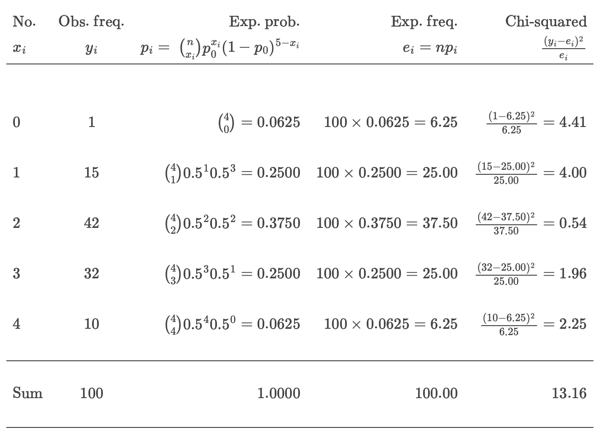
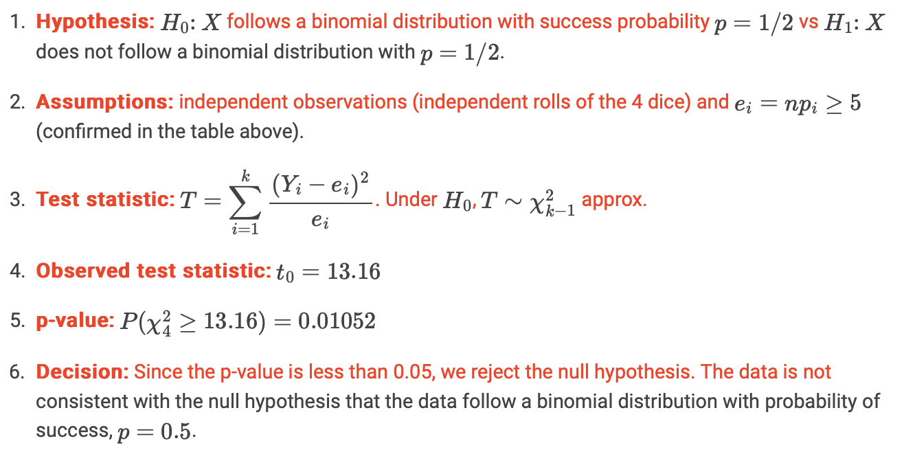

```{r setup, include=FALSE}
knitr::opts_chunk$set(echo = TRUE)
knitr::opts_chunk$set(message = FALSE, warning = FALSE)
```

```{r, echo=FALSE}
library(tidyverse)
library(knitr)
library(kableExtra)
library(devtools)
library(ggplot2)
library(dplyr)
library(janitor)
library(lubridate)
```


# Dishonest dice

A casino is worried about whether or not its die have been tampered with. To test this, a dealer rolls 4 dice 100 times and records how many even numbers (2, 4 or 6) appear.

**Can the scientist infer at the 5% significance level that the number of evens when $n=4$ dice are rolled follows a binomial random variable with $p=0.5$?**

Recall, if $X \sim B(n,p)$ then
$$P(X=x)=\binom{n}{x} p^x (1-p)^{1-x}$$

```{r}
# 5 events
y = c(1, 15, 42, 32, 10) # input the observed counts
x = 0:4 # define the corresponding group, number of possibilities
```

We calculate p assuming our data follows a bin dist. 
```{r}
n = sum(y) # number of rolls of 4 dice (sample size)
k = length(y) # number of groups
p = dbinom(x, size = 4, prob = 1/2) # obtain the p_i from the binomial pmf
p
```

Assumption:
```{r}
(ey = n * p) # calculate the expected frequencies

ey >= 5 #check assumption e_i >= 5
```

Observed test statistics:
- Large $t_0$ : big difference between $y_i$ and $e_i$ $\to$ properly reject $H_0$.
```{r}
(t0=sum((y-ey)^2/ey)) # test statistic

(pval = 1 - pchisq(t0, df = k-1)) # p-value
```

$\chi^2$ test:
```{r}
chisq.test(y, p = p) 
```

```{r}
par(mfrow = c(1,2)) # plot options
barplot(y, names.arg = x,
        main = "Observed frequency")
barplot(ey, names.arg = x,
        main = "Expected frequency")
```
The calculation is summarised in the following table:

```{r, echo=FALSE}

```

## Workflow 

Let $X$ be a random variable representing the number of even outcomes when 4 dice are rolled. The chi-squared goodness-of-fit test to test if $X$ follows a binomial distribution with $p=0.5$ is 

```{r, echo=FALSE}

```

Aside: this is a sensible conclusion as the data were actually generated using:

```{r}
set.seed(10)
y = table(rbinom(n = 100, size = 4, prob = 0.55))
```


In general, the closer the “alternative parameter” is to the hypothesised parameter, the larger the sample size you will need to be able to (correctly) reject the null hypothesis. Thought experiment: think about how hard it would be to reject the null hypothesis  if the data was generated using prob = 0.51 vs how easy it would be to reject the null hypothesis if the data was generated using prob = 0.7. [This is related to the power of the test and is something we’ll return to more formally later in semester.]

Note, in an exam you might be given some R code such as this:
```{r}
qchisq(c(0.01,0.025,0.05,0.1,0.9,0.95,0.975,0.99),4) |> round(3)
```

```{r}
qchisq(c(0.01,0.025,0.05,0.1,0.9,0.95,0.975,0.99),5) |> round(3)
```

And be expected to be able to identify the relevant parts to make your conclusion.


# Mammograms

Suppose that among 100,000 women with negative mammograms, 20 will have breast cancer diagnosed within 2 years; and among 100 women with positive mammograms, 10 will have breast cancer diagnosed within 2 years. Clinicians would like to know if there is a relationship between a positive or negative mammogram and developing breast cancer?

```{r}
x = matrix(c(10, 20, 90, 99980), ncol = 2)
colnames(x) = c("Breast cancer: yes", "Breast cancer: no") # D
rownames(x) = c("Mammogram: positive", "Mammogram: negative") # R
x
```

Using the code below, we have to take 1/result, since mosaic thinks the row order is reverse such that $R^-$ is first. 
Either you reverse the row-order or take the 1/x. 
```{r}
1/mosaic::relrisk(x)
```


1. Is it appropriate to use a relative risk to quantify the relationship between the risk factor (Mammogram result) and disease (Breast cancer)? If so calculate the relative risk and provide an interpretation.

RR can be calculated for prospective studies (PS)

We classify the women based on them having the risk factor => PS

$$RR = \frac{a(c+d)}{c(a+b)} = \frac{10(20 + 99980)}{20(10 + 90)} = 500$$

```{r}
(10*(20+99980))/(20*(10+90))
```

RR > 1 : breast cancer is more likely to occur in the positive mammogram group.

Given the risk factor is NOT present, the probability of having the disease is very small. The nominator is very large:
$P(D^+ | R^+)$ is 500 times as large as $P(D^+ | R^-)$

This is very far from 1. Women with a positive mammogram are 500 times more likely to develop breast cancer than women with a negative mammogram.


2. Calculate the odds ratio of having breast cancer for positive vs negative mammograms and provide an interpretation.

$$OR = \frac{ad}{cb} = \frac{10 \times 99980}{20 \times 90)} = 555.44$$

```{r}
(10*99980)/(90*20)
```

Same as for the RR, take the 1/result since we havenot reversed the row order for the risk factor. 
```{r}
1/mosaic::oddsRatio(x)
```

We could interpret this as the odds of developing breast cancer after a positive mammogram are 555.4 times the odds after a negative mammogram.

Alternatively, we could say the odds of developing breast cancer is 555.4 higher given a positive mammogram compared to a negative mammogram result.


3. Calculate a confidence interval for the odds-ratio, is there evidence that there might be a relationship between mammogram test results and breast cancer diagnosis?

$$SE( \log OR ) = \sqrt{1/10 + 1/90 + 1/20 + 1/99980} = 0.4$$

so the 95% confidence interval for log odds-ratio is $6.3 \pm 1.96 \times 0.4 \approx (5.52, 7.08)$ and the confidence interval for the odds-ratio is there for $(e^{5.52}, e^{7.08}) = (248.6, 1192.73)$. Importantly, the value of 1 does not lie in this CI so we can conclude that there is a statistically significant association between the risk and the disease (at a 5% level of significance).

```{r}
se = sqrt(1/10 + 1/20 + 1/90 + 1/99980) # marginal error (standard deviation)
or = (10*99980)/(20*90)

# generate the 95% confidence interval 
log_ci = c(log(or) - qnorm(0.975) * se, log(or) + qnorm(0.975) * se)
ci = exp(log_ci)
ci
```

There is a relation between the mammogram and breast cancer diagnosis

If OR is inside of the interval: no relation between R and D


Note that the difference between this and the interval calculated in the paragraph above are due to rounding errors.

Using the mosaic package (Pruim et al., 2017):
```{r}
y= x[c(2,1), ] # change row order
mosaic::oddsRatio(y, verbose = TRUE)
```


# Soccer goals

Goals per soccer game arrive at random moments, and could be reasonably modelled by a Poisson process. If so, the total number of goals scored in a soccer game should be a Poisson random variable.

Here are the number of goals scored in each of the $n=104$ games at the 2015 FIFA Women’s World Cup (source):

```{r}
goals <- c(
  1, 0, 0, 1, 1, 0, 0, 0, 1, 1, 2, 2, 4, 0, 10,
  0, 1, 1, 2, 3, 0, 4, 1, 3, 6, 0, 1, 0, 10, 1,
  2, 1, 0, 1, 1, 2, 3, 3, 3, 1, 2, 0, 0, 0, 0,
  1, 1, 1, 1, 1, 2, 0, 1, 0, 2, 2, 0, 1, 2, 1,
  1, 0, 1, 1, 0, 2, 2, 1, 0, 5, 2, 1, 4, 1, 1,
  0, 0, 1, 3, 0, 1, 0, 1, 2, 2, 0, 2, 1, 1, 1,
  0, 1, 0, 1, 2, 1, 2, 0, 2, 1, 0, 1, 5, 2
)
observed_goals = table(goals)
```

Test the null hypothesis that the number of goals scored per game follows a Poisson distribution.

You will need to estimate the $\lambda$ parameter and collapse categories (if necessary) to make sure the assumptions are met.
```{r}
n=104

# Expected frequencies based on Poisson distribution
lambda <- mean(goals) # statistical inference
lambda 

exp_freq <- dpois(as.numeric(names(observed_goals)), lambda) * length(goals)
# OR

# P(X=0), P(X=1), ..., P(X=9) and P(X>9) = 1-P(X=0)-P(X=1) - ... - P(X=9) 
hyp_probs = c(dpois(0:9, lambda), ppois(9, lambda, lower.tail = FALSE))

expected_goals = n * hyp_probs
round(expected_goals)
# since the last 7 cells are < 5 => we have to combine them
```


Beaware of chisq test and df! it assume that there are no parameters to estimate

Used pchi test

You will need to estimate the $\lambda$ parameter and collapse categories (if necessary) to make sure the assumptions are met.

```{r}
hist(goals, 
     breaks = 10, col = 'lightblue', main = 'Histogram of Data', 
     xlab = 'Number of goals scored pere game', ylab = 'Frequency')
```

```{r}
soccer_df = tibble(
  goals = 0:10,
  hyp_probs, 
  expected_goals,
  observed_goals = c(30, 40, 20, 6, 3, 2, 1, 0, 0, 0, 2)
)
```

```{r}
soccer_df |> 
  ggplot() + 
  aes(x = goals) + 
  geom_col(aes(y = observed_goals), alpha = 0.5) + 
  geom_point(aes(y = expected_goals), col = "blue") + 
  labs(y = "Number of games", x = "Number of goals in a game") + 
  scale_x_continuous(breaks = 0:10)
```

We need to amalgamate the categories with small expected cell counts:

```{r}
soccer_combo = soccer_df |> 
  slice(5:n()) |> 
  mutate(goals = "4+") |> 
  group_by(goals) |> 
  summarise(across(where(is.numeric), sum))
soccer_df2 = soccer_df |> 
  slice(1:4) |> 
  mutate(goals = as.character(goals)) |> 
  bind_rows(soccer_combo)
soccer_df2 |> gt::gt() |> 
  gt::fmt_number(columns = 2, decimals = 3) |> 
  gt::fmt_number(columns = 3, decimals = 1)
```

After amalgamating the categories, we’re left with 5 goal outcomes (0, 1, 2, 3 and 4+) and we have estimated one parameter from the data ($\lambda$, the mean parameter of the Poisson random variable) so our test statistic will follow a chi-squared distribution with $5-1-1=3$ degrees of freedom, $\chi_3^2$.


```{r}
soccer_df2 = soccer_df2 |> 
  mutate(chi_sq = (observed_goals - expected_goals)^2/expected_goals)
t0 = soccer_df2 |> pull(chi_sq) |> sum()
```

The observed test statistic is $t_0 = 6.148$.

```{r}
1 - pchisq(t0, df = 3)
```

The p-value is 0.1046 which is larger than 0.05, so we do not reject the null hypothesis at the 5% level of significance and conclude that the data are consistent with a Poisson distribution.

We could also use the `chisq.test()` function to calculate the test statistic:

```{r}
chisq.test(x = soccer_df2$observed_goals, p = soccer_df2$hyp_probs)
```

The test statistic is correct, but the p-value is not right because it is based on an incorrect degrees of freedom - the chisq.test() function doesn’t know that we’ve estimated a parameter from the data. Using this approach, we would need another step to calculate the p-value:

```{r}
results = chisq.test(x = soccer_df2$observed_goals, p = soccer_df2$hyp_probs)
t0 = results$statistic |> unname() # removes the name
t0
```

```{r}
1 - pchisq(t0, df = 3)

# or equivalently
pchisq(t0, df = 3, lower.tail = FALSE)
```


# Education

This dataset measures the educational attainment of Americans by age categories in 1984. Counts are presented in thousands. Data collected by the U.S. Bureau of the Census. Americans under age 25 are not included because many have not completed their education. The variables are:

- `Education`: Level of education achieved
- `Age_Group`: Age group (years)
- `Count`: 1000’s of Americans in this education and age category

Read in the data and check the size of your data. Think about what the number of rows actually means.

```{r}
## Reading in the data
library("tidyverse")
edu = readr::read_delim("https://raw.githubusercontent.com/DATA2002/data/master/education-by-age-census.txt",delim = "\t")
edu = edu |> janitor::clean_names()
knitr::kable(edu)
```

We can summarise this data in a more “human friendly” format using the `tidyr::pivot_wider()` function:

```{r}
edu |> tidyr::pivot_wider(id_cols = education, names_from = age_group, values_from =  count) |> 
  gt::gt() |> 
  gt::tab_spanner(label = "Age group", columns = 2:6) |> 
  gt::cols_label(education = "Education level")
```

```{r}
# an alternative approach is the xtabs function
# xtabs(count ~ education + age_group, data = edu)
```

Note that the categories aren’t in a sensible order, let’s reorder (relevel) them. To do this we’ll use the forcats package that is part of the tidyverse.

```{r}
edu = edu |> 
  dplyr::mutate(
    age_group = forcats::fct_relevel(age_group, ">64", after = 4),
    education = forcats::fct_relevel(education, 
                                     "Did not complete high school", 
                                     "Completed high school", 
                                     "College,1-3 years", 
                                     "College,4 or more years"))
tab = edu |> tidyr::pivot_wider(id_cols = education, 
                                 names_from = age_group, 
                                 values_from =  count)
tab |> 
  gt::gt() |> 
  gt::tab_spanner(label = "Age group", columns = 2:6) |> 
  gt::cols_label(education = "Education level") |> 
  gt::cols_align(align= "left", columns = 1)
```

Many of the questions below are about college vs non-college. Let’s add in a new variable in our data frame that identifies the college vs non-college categories.

```{r}
edu = edu |> 
  mutate(
    college = dplyr::if_else(stringr::str_detect(education, "College"),
                             "College", "No college")
  )
```

And let’s make a aggregated data frame edu_college that summarises over the different education levels, leaving totals for the college variable.

```{r}
edu_college = edu |> 
  dplyr::group_by(age_group, college) |> 
  dplyr::summarise(count = sum(count)) |> 
  dplyr::ungroup()
```


1. Which age category has the highest percentage of college graduates?

```{r}
edu_college |> 
  group_by(age_group) |> 
  mutate(pct_in_age_grp = round(count/sum(count), 2)*100) |> 
  arrange(college, age_group)
```
Answer: age group 35-44 with 66%


2. What percent of all Americans over age 25 never went to college?

All people tested are >25 years old.

```{r}
edu_college |>
  group_by(college) |> 
  summarise(count = sum(count)) |> # count how many went to collage
  mutate(freq = count/sum(count)) # to %
```

```{r}
x = rowSums(tab[,-1])
sum(x[1:2] / sum(x))
```

Answer: 62.4%  

3. Based on this data, is there evidence of a relationship between **age** category and **educational attainment**? In other words, is there evidence that younger people are more likely to have finished college than older people? 
Use graphical representation to compare the percent of people in each age group who have completed college. What is the appropriate statistical test to use here?

```{r}
edu |> ggplot() +
  aes(x = education, y = count, fill=age_group) + 
  geom_bar(stat='identity', position=position_dodge()) + 
  labs(y = "Number of people", x = NULL, fill = "Age group") + 
  scale_y_continuous(labels = scales::comma) + 
  coord_flip() + 
  theme(legend.position = "top")
```
```{r}
## Examine proportion within each population instead of counts.
edu |> ggplot() +
  aes(x = education, y = count, fill=age_group) + 
  geom_bar(stat='identity', position="fill") + 
  labs(y = "Proportion within each group", x = NULL, fill = "Age group") + 
  coord_flip() + 
  theme(legend.position = "top")
```
```{r}
## Limit to look at the category "finished college"
edu_college |> ggplot() +
  aes(x = college, y = count, fill=age_group) + 
  geom_bar(stat='identity', position=position_dodge()) + 
  scale_y_continuous(labels = scales::comma) + 
  labs(y = "Number of people", x = NULL, fill = "Age group") 
```
```{r}
## Examine proportion within each population instead of counts.
edu_college |> ggplot() +
  aes(x = college, y = count, fill=age_group) + 
  geom_bar(stat='identity', position="fill") + 
  labs(y = "Proportion", x = NULL, fill = "Age group") 
```

This is census data, there is no sampling and hence no statistical test is necessary (i.e. no chi-square test) because we have complete information, i.e. we know the true parameter values.

Answer: Yes, notice that for both "collage" categories, age group 25-34 has the highest count of people. 


# Heart attacks and smoking

A group of 200 people who have experienced a heart attack and 200 with no heart attack were asked if they were ever smokers.

The results are presented in the table below:

```{r, echo=FALSE}
# Define the data as a data frame
data <- data.frame(
  Smoked = c("Yes", "No"),
  `Heart attack (Yes)` = c(33, 167),
  `Heart attack (No)` = c(18, 182)
)

# Set row names for the first column
row.names(data) <- data$Smoked
data$Smoked <- NULL

# Generate the table with a caption
kable(data, 
      col.names = c("Smoked / Heart Attack", "Yes", "No"), 
      full_width = F)
```


1. Is it appropriate to use a relative risk to quantify the relationship between the risk factor (Smoking) and disease (Heart attack)? If so calculate the relative risk.

It is not appropriate to use relative risk here as the study is retrospective and the participants were enrolled by disease status (heart attack) and not the risk.


2. Calculate and interpret the odds ratio of having a heart attack for smokers compared to non-smokers.

```{r}
OR <- (33*183)/(18*167)
```


$$\hat{OR} = \frac{ad}{bc} = \frac{33 \times 183}{18 \times 167} = 2.01$$
Answer: the odds of being a smoker is 2 times higher for people who have had a heart attack compared to people who have not had a heart attack.

3. Calculate a confidence interval for the odds ratio, is there evidence that there might be a relationship between smoking and heart attacks?

```{r}
(z_star <- qnorm(0.975)) # 2-sided: 2.5 % in each tail
qnorm(0.95) # 1-sided: 5 % in one tail
```


```{r}
SE_log_OR = sqrt(1/33 + 1/18 + 1/167 + 1/182)

# log ci
log_ci = c(log(OR) - z_star*SE_log_OR, log(OR) + z_star*SE_log_OR)
         
# ci
(ci = exp(log_ci))
```

The “neutral” value for the odds-ratio, 1, does not lie in this CI so there is significant evidence of an association between heart attack and smoking at the 5% level of significance.
