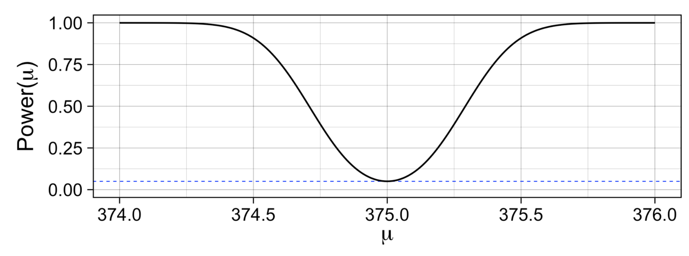
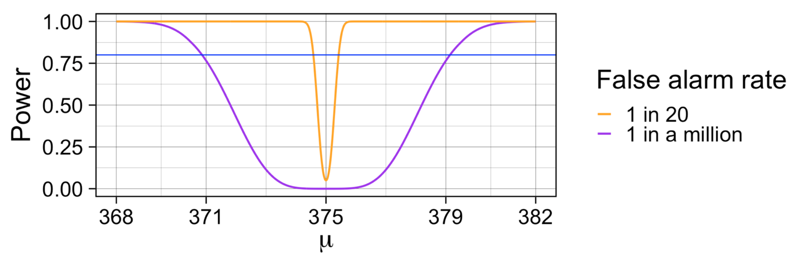
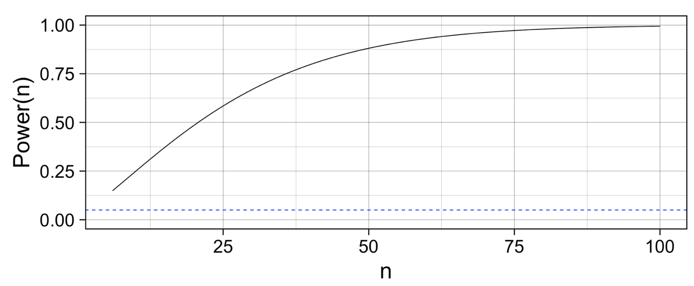

```{r setup, include=FALSE}
knitr::opts_chunk$set(echo = TRUE)
knitr::opts_chunk$set(message = FALSE)
```

```{r, echo=FALSE}
library(tidyverse)
library(dplyr)

library(knitr)
library(kableExtra)
library(devtools)

library(ggplot2)

library(janitor)
library(lubridate)

library(stats)
library(mosaic)
```

# Week 4 Lecture Recap

## Type Ⅰ & II Error

|      |  **True $H_0$**  |  **False $H_0$**  |
|:----:|:----:|:----:|
| **Reject $H_0$** | Type Ⅰ Error ($\alpha$) | Statistical Power (1-$\beta$) |
| **Don't reject $H_0$** | Correct Decision | Type Ⅱ Error ($\beta$) |
\
\

- Type Ⅰ Error (*False Positive*) $\ \ $ 👉 $\ \ $ $P\left(\text{Reject $H_0$} \ | \ \text{True $H_0$}\right)=\alpha$

- Type Ⅱ Error (*False Negative*) $\ \ $ 👉 $\ \ $ $P\left(\text{Don't reject $H_0$} \ | \ \text{False $H_0$}\right)=\beta$

- Statistical Power $\ \ $ 👉 $\ \ $ $P\left(\text{Reject $H_0$} \ | \ \text{False $H_0$}\right)=1-\beta$

\

$\alpha$ (Type Ⅰ Error) ↓ $\ \ \ $ 👉 $\ \ \ $ $\beta$ (Type Ⅱ Error) ↑ $\ \ \ $ 👉 $\ \ \ $ $1-\beta$ (Statistical Power) ↓

$\alpha$ (Type Ⅰ Error) ↑ $\ \ \ $ 👉 $\ \ \ $ $\beta$ (Type Ⅱ Error) ↓ $\ \ \ $ 👉 $\ \ \ $ $1-\beta$ (Statistical Power) ↑

Why? 

👉 If we use small $\alpha$ (e.g. 0.0000001) to reduce the chances of making a type Ⅰ error, then **we're very unlikely to reject any $H_0$ (regardless of whether it's true or false $H_0$)**, since we'll reject $H_0$ if and only if the p-value is smaller than 0.0000001.
\
While it decreases the probability of not rejecting true $H_0$, **it increases the probability of not rejecting false $H_0$ (i.e. $\beta$: type Ⅱ error)** at the same time, and thus, it decreases statistical power ($1-\beta$).

In a context where making a type Ⅰ error is more dangerous than the type Ⅱ error, we can make $\alpha$ small at the cost of increasing the chances of making a type Ⅱ error.

I encourage you to think about the other case too. What happens if we increase $\alpha$ in a context where making a type Ⅱ error is more dangerous than the type Ⅰ error? How and why $\beta$ and statistical power change, as $\alpha$ decreases?

\
\

## Statistical Power

### Power as a function of $\mu$

```{r, echo=FALSE}

```

The power of a test ↑, as we observe a sample mean $\bar{x}$ far away from the $\mu=375$.

👉 As $|\bar{x} - \mu|$ ↑, power ↑

In other words, as we observe $\bar{x}$ such that $|\bar{x} - \mu|$ is large, we're confident that we'll correctly reject false $H_0$.
\

### Power as a function of $\alpha$

```{r, echo=FALSE}

```

When $\alpha = 0.05$ (orange curve), to achieve a certain level of power (the probability that we correctly reject false $H_0$), it requires smaller $|\bar{x} - \mu|$.

To achieve the same level of statistical power with much smaller $\alpha$ (purple curve), it requires much larger $|\bar{x} - \mu|$ because you'll only reject $H_0$ if and only if the p-value is less than $0.000001$.

⚠️ Again, if we use large $\alpha$ to increase statistical power, it'll also increase the probability that we incorrectly reject true $H_0$.
\

### Power as a function of $n$

```{r, echo=FALSE}

```

The power of a test ↑, as the sample size $n$ ↑


# Group work (Power)

1. What are the two types of errors you can make when performing a hypothesis test?

* Type I error: rejecting $H_0$ when in reality $H_0$ is true. 
* Type II error: not rejecting $H_0$ when $H_0$ is actually false. 

2. What is the power of a test?

The power of a (binary) hypothesis test is the probability that the test correctly rejects the null hypothesis when a specific alternative hypothesis is true: 
$$\text{Power} = P(\text{ Reject } H_0 | H_1 \text{ is true})$$


3. When doing a simple test for a mean, discuss how varying the level of significance $\alpha$, the alternative population mean $\mu_1$, the sample size $n$ and the population standard deviation $\sigma$ could affect Power($\mu_1$).

* As $\alpha$ increases, the critical value decreases and the power increases. 
* As $\mu_1$ increases the power increases. 
* As $n$ increases, the power increases. As  increases, the power decreases.

4. Suppose you have $n$ observations, $X_1,X_2,...,X_n$, are independent and identically distributed $N(\mu ,1)$, and we wish to test $H_0 : \mu=0$ vs $H_1 : \mu > 0$. Use the `pwr.t.test()` function from the pwr package to find the smallest sample size, $n$, we could choose to be at least 90% sure of finding evidence at the 5% level when $\mu=1$?


**Answer**: $n = 10.08 \approx 11$ is the smallest sample size required to achieve 90% power with a 5% significance level and Cohen’s d of 1.

$$d=\frac{|\mu_1 - \mu_2|}{\sigma}=\frac{0-1}{1}=1$$

```{r}
library(pwr)
pwr.t.test(d = 1, 
           sig.level = 0.05, 
           power = 0.9, 
           type = "one.sample",  # use ?pwr.t.test 
           alternative = "greater") 
```

# Questions

## Blood alcohol readings

The following are 30 blood alcohol determinations made by Analyzer GTE-10, a 3-year-old unit that may be in need of re-calibration. All 30 measurements were made using a test sample on which a properly adjusted machine would give a reading of 12.6%.

```{r}
bac = c(12.3,12.7,12.6,13.1,13.2,12.8,13.1,12.9,13.1,12.4,13.6,12.7,12.6,13.1,12.4,12.6,13.3,12.6,12.4,13.1,12.9,12.6,12.7,12.5,12.4,12.4,12.6,12.7,12.4,12.9)
n = length(bac)
xbar = mean(bac)
s = sd(bac)
c(n, xbar, s) |> round(3)
```

1. Let $\mu$ denote the true average reading that the Analyzer GTE-10 would give on the test sample. Write out the hypothesis for the Analyzer GTE-10 being faulty.

$$H_0 : \mu_0 = \mu = 12.6% \text{ vs. } H_1 : \mu_0 \neq \mu = 12.6%$$

2. What are the assumptions of this test? Are they satisfied?

- independent and identically distributed (iid): $X_1,\ X_2,\ ...,\ X_n$ are $\text{i.i.d}$ random variables 
- follow $N(\mu, \sigma^2)$.

We can check for the normality assumption using a box plot (looking for symmetry) or a normal quantile-quantile plot (looking for the points being close to the straight line):
```{r}
par(mfrow = c(1,2), mar = c(4,4,1,1))
boxplot(bac, ylab = "Blood alcohol concentration")
qqnorm(bac, main = NULL)
qqline(bac, col = "red")
```

In the figure above, there’s some indication of some skewness in the box plot (the lower tail is shorter than the upper tail and the median is closer to the first quartile than the third quartile) and Q-Q plot (small departure at the lower end), but it’s not too bad, so we can say the normality assumption is approximately satisfied.

3. Assuming that the readings are normally distributed, the test statistic will follow a $t$-distribution. How many degrees of freedom will the test have?

```{r}
(t0 = (mean(bac) - 12.6)/(sd(bac)/sqrt(n)))
```

$$T = \frac{\bar{X} - \mu_0}{S/\sqrt{n}}\sim t_{30-1}\ \ \text{ Under } \ H_0$$


4. Calculate the observed test statistic, $t_0$.


$$t_0 = \frac{\bar{x} - \mu_0}{s / \sqrt{n}} = \frac{12.75-12.6}{0.324 / \sqrt{30}}= 2.644$$

```{r}
qt(c(0.9, 0.95, 0.975), df = 29) |> round(3)
```

5. The critical value at the 5% level of significance is 2.045. At the level of significance $\alpha=0.05$, what is your conclusion?

⚠️ We choose a critical value $c$ such that $2P(t_{29 }\ge c)=0.05$, since it's a two-sided test.

Therefore, the correct critical value is $c=2.045230$, as $2P(t_{29} \ge 2.045)=0.05$.

The observed test statistic $t_0=2.644$ is larger than the critical value $c=2.045$, so we reject $H_0$.

Why? 👉 Since $2P(t_{29} \ge 2.644) = 0.013$ is smaller than $2P(t_{29} \ge 2.045)=0.05$.

```{r}
2*pt(t0, df = 29, lower.tail = FALSE) # 2P(t_29 > 2.644)
```

6. Perform the test in R using the `t.test()` function.

```{r}
t.test(bac, mu = 12.6, alternative = "two.sided")
```

P-value: $2P(T \ge |t_0|) = 2P(t_{29} \ge 2.644) = 0.013$

**Decision**: Since the p-value is less than $\alpha = 0.05$, we reject $H_0$.

## Life satisfaction

A research study was conducted to examine the differences between older and younger adults on perceived life satisfaction. Thirty older adults (between 40 and 50) and thirty younger adults (between 20 and 30) were give a life satisfaction test (known to have high reliability and validity). Scores on the measure range from 0 to 60 with high scores indicative of high life satisfaction with low scores indicative of low life satisfaction. We’re interested in seeing if there is a difference in the mean life satisfaction between young and old people. Carefully study the R output below before answering the questions below.

```{r}
# age: 20-30
Young = c(24, 26, 40, 29, 29, 41, 32, 19, 23, 25, 37, 31, 31, 29, 24, 
          42, 32, 13, 33, 25, 20, 26, 20, 23, 23, 15, 34, 29, 20, 38)
# age: 40-50
Old = c(27, 26, 45, 34, 34, 45, 36, 20, 22, 24, 35, 31, 26, 41, 31, 
        37, 31, 12, 38, 26, 22, 27, 21, 31, 23, 24, 27, 33, 22, 40)

# Base R approach:
c(length(Young), length(Old))

# \mu
c(mean(Old), mean(Young), mean(Old-Young)) |> round(2)

# \sigma
c(sd(Old), sd(Young), sd(Old-Young)) |> round(3)
```


```{r}
# tidyverse method
library("tidyverse")
dat = tibble(
  satisfaction = c(Young, Old), 
  age = c(rep("Young", length(Young)),
          rep("Old", length(Old))))
dat |> 
  group_by(age) |> 
  summarise(
    n = n(),
    mean = mean(satisfaction),
    sd = sd(satisfaction))
```

```{r}
# some quantiles from distributions
qt(c(0.025,0.05,0.1),58)

qnorm(c(0.025,0.05,0.1))

qt(c(0.025,0.05,0.1),29)
```


```{r}
# Quick visualisation using base R (not ggplot)
par(mfrow = c(1,2), mar = c(4,5,0.5,0.5))
boxplot(Young, Old, names = c('Young', 'Old'), ylab = "Life satisfaction")
boxplot(Old - Young, ylab = 'Difference in life satisfaction\n(Old - Young)')
```


1. Which hypothesis test should be used and why?

Two sample $t$-test because we have two independent populations, one set of observations sampled from a “young” population and another set of observations from an “old” population.


2. State the null and alternative hypotheses.

$$H_0 : \mu_{Young} - \mu_{Old} = 0 \text{  vs.  } H_1 : \mu_{Young} - \mu_{Old} \neq 0$$
or
$$H_0 : \mu_{Young} = \mu_{Old} \text{  vs.  } H_1 : \mu_{Young} \neq \mu_{Old}$$


3. What assumptions have been made in order for the test to be valid? Are they reasonable? Give reasons.

* $X_1,...,X_n$ are iid and follow $N(\mu_X , \sigma^2)$
* $Y_1,...,Y_n$ are iid and follow $N(\mu_Y , \sigma^2)$
* The two populations are independent (i.e.  is independent of )

Checking the assumptions:
- Both boxplots for young and old look symmetric with no outliers - justifying the assumption of normality (or could mention that  is large)
- Young seems to have slightly lower spread than old, but not concerning for assumption of equal variance.
- Independence assumption doesn’t appear to be violated based on the way the data was collected in the question proposed.


4. Calculate the appropriate test statistic.

$$n_{Young} = n_{Old} = 30$$

$$s_p = \sqrt{\frac{(n_Y - 1)s_C^2 + (n_O - 1)s_M^2}{n_Y + n_O - 2}} 
= \sqrt{\frac{29 \times 7.436^2 + 29 \times 7.835^2}{58}} = 7.638 $$

$$t_0 = \frac{\mu_O - \mu_Y}{s_p \sqrt{1/n_Y + 1/n_O}}\sim t_{n_x+n_y-2}$$
$$t_0 = \frac{29.7 - 27.767}{7.638 \sqrt{\frac{1}{30} + \frac{1}{30}}} = 0.98$$


5. By comparing the test statistic with an appropriate critical value, what is your conclusion and why?

```{r}
qt(c(0.9, 0.95, 0.975), 58) |> round(3)
```
$t_0 = 0.98 < 2.002 = c$ => so we do not reject  at the 5% level of significance.

6. Perform the test in R using the t.test() function.

```{r}
# without TRUE, it will perform a Welch test
t.test(Old, Young, var.equal = TRUE)

t.test(satisfaction ~ age, data = dat, var.equal = TRUE)
```

After talking to the person who is in charge of the study, you find out that the old and young adults are NOT independent groups. Instead, thirty young adults were given the life satisfaction test when they enrolled in the study and then given the test again ten years later.

```{r}
paired_dat = tibble::tibble(Young, Old) |>
  dplyr::mutate(
    Difference = Old - Young
  )
dplyr::glimpse(paired_dat)
```

```{r, echo=FALSE}
paired_dat |> 
  dplyr::summarise(
    n = n(),
    mean_old = mean(Old),
    sd_old = sd(Old),
    mean_young = mean(Young),
    sd_young = sd(Young),
    mean_diff = mean(Difference),
    sd_diff = sd(Difference)
  ) |> 
  gt::gt() |> 
  gt::tab_spanner(
    label = "Old",
    columns = ends_with("old")
  ) |> 
  gt::tab_spanner(
    label = "Young",
    columns = ends_with("young")
  ) |> 
  gt::tab_spanner(
    label = "Difference",
    columns = ends_with("diff")
  ) |> 
  gt::cols_label(
    n = "Sample size",
    mean_old = "Mean",
    sd_old = "SD",
    mean_young = "Mean",
    sd_young = "SD",
    mean_diff = "Mean",
    sd_diff = "SD"
  ) |> 
  gt::fmt_number(
    columns = starts_with("mean"),
    decimals = 2
  )|> 
  gt::fmt_number(
    columns = starts_with("sd"),
    decimals = 2
  )
```


7. Explain why the previous test is now inappropriate.

The observations are paired and thus no longer independent.


8. Which hypothesis test should now be used?

We should used a paired $t$-test.


9. Repeat steps b-e.

Let \(\mu_d\) be the population mean difference in perceived life satisfaction levels between when someone is old and young.

$$H_0: \mu_d = 0 \quad \text{ vs. } \quad H_1: \mu_d \neq 0$$

$$t_0 = \frac{1.93 - 0}{4.17 / \sqrt{30}} = 2.5354$$

$$P(t_{29} < -2.04) = 0.025, \text{ therefore } P(|t_{29}| > 2.5354) < 0.05$$

There is enough evidence to reject the null hypothesis.


10. Perform the test in R using the `t.test()` function.
```{r}
t.test(paired_dat$Difference)
```


## Power, effect size and sample size

### Calculating effect size given a test statistic

The effect size (Cohen's $d$) is $\frac{|\mu_1 - \mu_0|}{\sigma}$. According to Cohen (1988), the effect size is 
- small ($0.2$ to $0.5$), 
- medium ($0.5$ to $0.8$) or 
- large ($> 0.8$). 

In the context of a one-sample $t$-test we can estimate Cohen’s $d$ from the observed test statistic:
$$t_0 = \frac{\bar{x} - \mu_0}{s / \sqrt{n}}$$
where $$d = \frac{t_0}{\sqrt{n}}$$

You run a one-sample $t$-test and discover a significant effect; R reports $t_0 = 3.24$ with $25$ degrees of freedom and $p < 0.05$. Using the above formulas, calculate $d$ and determine whether the effect size is small, medium or large.

$$d= \frac{t_0}{\sqrt{n}} = \frac{3.24}{\sqrt{25+1}}=0.635$$
Which means that the effect size is medium $0.5 < 0.634 < 0.8$. 

```{r}
t_0 = 3.24
n = 25 + 1
d = t_0 / sqrt(n)
d
```


### Using pwr.t.test()

1. Using `pwr.t.test()`, find how many people per group ($n$) you would need to detect an effect size of $d=0.4$ with 80% power at the 5% significance level in a two sample $t$-test with a two sided alternative hypothesis. 

```{r}
library(pwr)
pwr.t.test(d = 0.4, 
           sig.level = 0.05, 
           power = 0.8, 
           type = "two.sample",  
           alternative = "two.sided") 
```

**Answer**: We would need 100 people in each group to achieve a power of at least 80%.

2. How does this change as the effect size changes (e.g. from 0.1 to 0.8)? 

```{r}
d_vals = seq(0.1, 0.8, 0.01)
req_n = NULL
for(i in seq_along(d_vals)){ 
  req_n[i] = pwr.t.test(d = d_vals[i],
           power = .8,
           sig.level = .05,
           alternative = "two.sided",
           type = "two.sample")$n
}
```

3. Plot the sample size required to achieve a power of 80% against effect size.

```{r fig1, fig.cap="Sample size required to achieve 80% power against effect size. The dashed lines indicate the sample size required to achieve a power of 0.8 when the effect size is 0.4."}
par(mar = c(4,4,0.5,0.5))
plot(d_vals , req_n, type = "l", 
     ylab = "Required sample size", 
     xlab = "Effect size")
abline(v = 0.4, lty=2, col = "steelblue")
abline(h = 100, lty=2, col = "steelblue")
```

In \@ref(fig:fig1) we see that as the effect size decreases, the sample size required to achieve 80% power increases dramatically.


