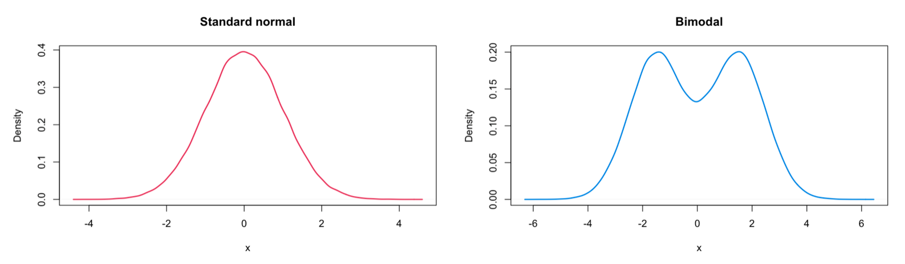

```{r setup, include=FALSE}
knitr::opts_chunk$set(echo = TRUE)
knitr::opts_chunk$set(message = FALSE)
```

```{r, echo=FALSE}
library(tidyverse)
library(dplyr)

library(knitr)
library(kableExtra)
library(devtools)

library(ggplot2)

library(janitor)
library(lubridate)

library(stats)
library(mosaic)
```

# Group work

Answer the following questions in small groups.

Five sets of identical twins were selected at random from a population of identical twins. One child was selected at random from each pair to form an “experimental group.” These five children were sent to school. The other five children were kept at home as a control group. At the end of the school year the following IQ scores were obtained.

```{r}
# Create a data frame with the data
data <- data.frame(
  Pair = 1:5,
  Experimental_group = c(110, 125, 139, 142, 127),
  Control_group = c(112, 120, 128, 135, 126)
)

# Display the table with kable
data %>%
  kbl() %>%
  kable_styling(
      full_width = F)
```


1. Which of the tests that we have considered so far in DATA2002 can be applied here? Why might you use one instead of the other?

An identical twin example is another case for the **paired sample $t$-test**. Identical twins are biologically similar to each other and they could affect each other by spending time together. Thus, they're **not independent** of each other, meaning that we don't have two independent populations. Rather, we have a pair of observations. Therefore, a paired sample $t$-test is appropriate.

Paired sample $t$-test, sign test applied to the differences, Wilcoxon signed rank test. 

- The paired $t$-test is the most powerful test when the assumptions are met. 
- The sign test is very robust, but not very powerful. 
- The Wilcoxon signed rank test is a compromise between the paired $t$-test and sign test, as it is reasonably robust and powerful.

**Hypothesis**:
$$H_0 : \mu_{E} - \mu_{C} = 0 \text{  vs.  } H_1 : \mu_{E} - \mu_{C} \neq 0$$

**Normality check**:  
This is not usefull, since we have such a small dataset, we already know that the normality assumption will not hold. 
```{r}
# Quick visualisation using base R (not ggplot)
par(mfrow = c(1,2), mar = c(4,5,0.5,0.5))
boxplot(Exp, Con, names = c('Exp', 'Con'), ylab = "IQ")
boxplot(Exp - Con, ylab = 'Difference in life satisfaction\n(Old - Young)')
```


2. If you were to proceed with a Wilcoxon signed rank test, calculate the test statistic.

```{r, echo=FALSE}
# Create a data frame with the data
data <- data.frame(
  Pair = 1:5,
  Experimental_group = c(110, 125, 139, 142, 127),
  Control_group = c(112, 120, 128, 135, 126),
  Difference = c(-2, 5, 11, 7, 1),
  Abs_Difference = abs(c(-2, 5, 11, 7, 1)),
  Rank = c(2, 3, 5, 4, 1),
  Signed_rank = c(-2, 3, 5, 4, 1)
)

# Display the table with kable
data %>%
  kbl(caption = "Paired Comparison Table for Experimental and Control Groups") %>%
  kable_styling(full_width = F)
```

**Answer**: $w^+ = 3 + 5 + 4 + 1$ and $w^- = 2$


3. Under the null hypothesis of no difference in the mean IQ score between the experimental and control group, what is the expected value of the Wilcoxon signed rank test statistic?

If there was no difference between the experimental and control group we’d expect the ranks to be evenly distributed across the positive and negative differences.

The total sum of the ranks is: $1+2+3+4+5 = 15$, so we’d expect to see $15/2 = 7.5$.  
i.e., $E(W^+) = E(W^-) = 7.5$

Equivalently, $\frac{n(n+1)}{4}=\frac{5(5+1)}{4}=7.5$, since $1+2+3+4+5 = \frac{5(5+1)}{2} = 15$.


4. Let’s say we are testing a one sided alternative, i.e. the researchers hypothesised that the experimental group that were sent to school had higher IQs than the control group. If you had to guess which of the following **p-values** looks most reasonable for this example? Don’t perform the test in R, just think about the observed test statistic, the expected test statistic and the sample size.

a. 0.0001
b. 0.9663
c. **0.0938** $\Rightarrow$ around 10%.
d. 0.4367

There’s perhaps some evidence of a difference (the observed test statistic isn’t very close to 7.5), but we don’t have many observations so we can’t make a strong statement one way or the other - so we might expect to see a p-value that is smallish but not extremely small.

Strictly speaking, at the 5% level of significance we would not reject the null hypothesis that the average IQ is the same for the experimental and control group.

```{r}
twins = tibble::tribble(
     ~experimental,  ~control,
    110L, 112L,
    125L, 120L,
    139L, 128L,
    142L, 135L,
    127L, 126L
    )
wilcox.test(twins$experimental, twins$control, paired = TRUE, alternative = "greater")
```
# Questions


## Wilcoxon signed-rank test

🤔 **Motivation**

The sign test ignores the magnitude of data and only uses the *sign* (+ / -) of differences between data and $\mu_0$

👉 Low statistical power

What if we want to use more information, while the normality assumption doesn't hold? 👉 **Rank-based test**

**Workflow**

1. Compute $D_i=X_i-\mu_0$ for $i=1,\,2,\,...,\ n$

2. Take the absolute values of those differences (i.e., $|D_1|,\ ...,\ |D_n|$)

3. Assign ranks to the corresponding absolute differences
\
$R_1,\ R_2,\ ...,\ R_n → |D_1|,\ |D_2|,\ ..., \ |D_n|$
\
⚠️ For tied values, assign the average of the corresponding rank

4. Let $w^+$ be the sum of all the ranks $R_i$'s for *positive* $D_i$'s
\
👉 $w^+=\sum_{i\ |\ d_i>0}R_i$

5. Let $w^-$ be the sum of all the ranks $R_i$'s for *negative* $D_i$'s
\
👉 $w^-=\sum_{i\ |\ d_i<0}R_i$

6. Decision:
- Reject $H_0: \mu = \mu_0$ in favour of $H_1: \mu>\mu_0$ if $w^+$ is large enough
- Reject $H_0: \mu = \mu_0$ in favour of $H_1: \mu<\mu_0$ if $w^+$ is small enough
- Reject $H_0: \mu = \mu_0$ in favour of $H_1: \mu\ne\mu_0$ if $\text{min}(w^+, w^-)$ is small enough


Then under the symmetric distribution assumption, **roughly half of $d_i=x_i-\mu_0$ will be positive and the rest half of them will be negative**
\
👉 We expect $W^+$ and $W^-$ to be *nearly equal*


### Drug abuse and IQ

In a study of drug abuse in a suburban area, investigators found that the median IQ of arrested abusers who were 16 years of age or older was 107. The following table show the IQs of a random sample of 9 persons from another suburban area.

```{r, echo=FALSE}
subjects <- 1:9
iq <- c(100, 90, 135, 108, 107, 119, 127, 109, 105)

# Create a data frame with the data
data <- data.frame(Subject = subjects, IQ = iq)

# Transpose the data for the desired format
data_transposed <- t(data)
colnames(data_transposed) <- data$Subject
row.names(data_transposed) <- c("Subject", "IQ")

# Display the table with kable
data_transposed %>%
  kbl(caption = "IQ Scores by Subject") %>%
  kable_styling(full_width = F)
```

1. Check for normality in the data. 

```{r}
par(mfrow = c(1,2), mar = c(4,4,1,1))
boxplot(iq, ylab = "IQ score")
qqnorm(iq, main = "")
qqline(iq)
```

It’s hard to be sure with only 9 observations. 
- Q-Q plot: the points are reasonably close to the line, so the normality assumption probably isn’t wildly inappropriate, but let’s err on the side of caution and go with a non-parametric test anyway.


2. Using the Wilcoxon signed-rank test can the researchers conclude that the mean IQ of arrested abusers who are 16 or older from the population of interest is higher than 107? Try calculating the test statistic by hand and use the normal approximation to identify the correct p-value from the options below. Confirm your calculations with R.


```{r}
dat = tibble(iq)
dat = dat %>% 
  mutate(d = iq - 107, # compute differences x_i - mu_0
         abs_d = abs(d)) # take absolute values

effective_dat = dat %>% filter(d != 0) # filter out no difference values (ties)
effective_dat$r = rank(effective_dat$abs_d)

w_plus = sum(effective_dat$r[effective_dat$d > 0]) # calculate w+
w_minus = sum(effective_dat$r[effective_dat$d < 0]) # calculate w-
```

The table below shows the differences $d_i=x_i-107$ and process of calculating the signed ranks.

|  **Subject**  |  **1**  |  **2**  |  **3**  |  **4**  |  **5**  |  **6**  |  **7**  |  **8**  |  **9**  | 
|:----:|:----:|:----:|:----:|:----:|:----:|:----:|:----:|:----:|:----:|
| $x_i$ | 100 | 90 | 135 | 108 | 107 | 119 | 127 | 109 | 105 |
| $d=x-107$ | -7 | -17 | 28 | 1 | 0 | 12 | 20 | 2 | -2 |
| $|d_i|$ | 7 | 17 | 28 | 1 | 0 | 12 | 20 | 2 | 2 |
| $r_i=$Rank of $|d_i|$ | 4 | 6 | 8 | 1 |  | 5 | 7 | 2.5 | 2.5 |
| Signed rank | -4 | -6 | 8 | 1 |  | 5 | 7 | 2.5 | -2.5 |

The effective sample size is $n=8$, as one of the differences is 0 (neither positive nor negative).

The Wilcoxon signed-rank test for the IQ of the arrested abusers who are 16 or older from the population of interest is:

#### Workflow
**Hypothesis**:
$$H_0: \mu = 107 \ \ \ \text{vs} \ \ \ H_1: \mu > 107$$

**Assumption**:  
$X_i$'s are independently sampled from a symmetric distribution

**Test statistic**:
$$W^+=\sum_{i \ | \ D_i>0}R_i\sim WSR\left(n\right)\ \text{ under }\ H_0\ \text{ where }\ D_i = X_i - 107\ \text{ and }\ R_i\ \text{ is a rank of } |D_i|$$

**Observed test statistic**:
$$w^+ = 8 + 1 + 5 + 7 + 2.5 = 23.5$$
$$w^- = 4 + 6 + 2.5 = 12.5$$

Get R to calc:
```{r}
t0 = (w_plus - ew)/(sqrt(varw)) # (23.5 - E(W+)) / sqrt(Var(W+)) - standardisation
p_val = 1 - pnorm(t0) # approximate the p-value
# or equivalently, pnorm(t0, lower.tail = FALSE)
c(t0, p_val)
```

Expected W and variance of W:
```{r}
dat = tibble(iq)
dat = dat |> mutate(
  d = iq - 107,
  abs_d = abs(d)
)

effective_dat = dat |> filter(d !=0 )
effective_dat$r = rank(effective_dat$abs_d)
w_plus = sum(effective_dat$r[effective_dat$d > 0])
w_minus = sum(effective_dat$r[effective_dat$d < 0])

n = nrow(effective_dat)
ew = n*(n+1)/4
varw = sum(effective_dat$r^2)/4
c(ew, varw)
```

**P-value**:  
⚠️ Since there are ties, we can't calculate an exact p-value  👉  We approximate the p-value using the normal distribution

$E(W^+) = \frac{n(n+1)}{4} = \frac{8(8+1)}{4}=18$

$\text{Var}(W^+) = \frac{1}{4}\sum_{i=1}^{8}r_i^2 = \frac{1}{4}\left(4^2 + 6^2 + 8^2 +\ ...\ + 2.5^2\right) = 50.875$

$P(W^+\ge w^+) = P(W^+\ge 23.5) \approx P\left(Z\ge \frac{w^+ - E(W^+)}{\sqrt{\text{Var}(W^+)}}\right) = P\left(Z\ge \frac{23.5 - 18}{\sqrt{50.875}}\right) = P(Z\ge 0.77) = 0.22$

Note that $\frac{w^+ - E(W^+)}{\sqrt{\text{Var}(W^+)}}$ is standardisation. In other words, we're making the observed test statistic $w^+$ follow a standard normal distribution (converting $w^+$ to $z$) so that we can approximate the p-value using the standard normal distribution.

**Decision**:

Since the p-value is greater than $\alpha = 0.05$, we don't reject $H_0$, meaning that the data is consistent with $H_0$ that the IQ of the arrested abusers who are 16 or older from the population of interest is 107


```{r}
# specify correct = FALSE to ensure the results match. 
# In general though it’s fine (and probably better) to leave it as the default setting correct = TRUE. In large sample sizes the difference will be negligible.
wilcox.test(iq, mu = 107, alternative = "greater", correct = FALSE)

# alternatively
# wilcox.test(iq - 107, alternative = "greater", correct = FALSE)
```

## Wilcoxon rank-sum test

🤔 **Motivation**

An alternative to the two-sample $t$-test.
\
👉 We want to compare the means of two independent populations, while the normality assumption doesn't hold.

The sign and Wilcoxon signed-rank test still require **a symmetric distribution assumption**.

We don't always have a symmetric distribution for $D_i$'s.

👉 Wilcoxon rank-sum test

**Workflow**

1. We have two independent populations $X_1,\ X_2,\ ,\ ...,\ X_{n_{x}}$ and $Y_1,\ Y_2,\ ,\ ...,\ Y_{n_{y}}$, following the same kind of distribution but differing in location. 👉 $\mu_x = \mu_y + \theta$.

2. Combine those two independent samples $X$ and $Y$.

3. Rank this new pooled data

4. Sum up ranks associated with $X$. In other words, ranks are summed over one of the two groups.
\
👉 $W=R_1 + R_2 +\ ...\ + R_{n_x}$

5. Calculate $E(W)\approx \text{Proportion}\times\text{Total rank sum} = \frac{n_x}{N}\times\frac{N(N+1)}{2} = \frac{n_x(N+1)}{2}$ under $H_0$.

### Weight gain

The weight of 5 pigs on diet X and 5 pigs on diet Y are

Diet $X : \{12, 16, 16, 12, 10\}$ and diet $Y : \{30, 12, 24, 32, 24\}$.

Test if there is a difference in weight using the Wilcoxon rank-sum test. 
In this test we only care about the rank. 

What is the corresponding p-value?


```{r}
wdat = data.frame(weight = c(12, 16, 16, 12, 10, 30, 12, 24, 32, 24),
                  diet = rep(c("X", "Y"), each = 5))
```

```{r}
wdat = wdat %>%
    mutate(ranks = rank(weight)) # rank the data
wdat
```

```{r}
wdat %>%
  group_by(diet) %>% # group data by the diet group (X vs Y)
  summarise(sum(ranks)) # for each group, sum up the ranks
```

#### Workflow

**Hypothesis**:
$$H_0: \mu_x = \mu_y \ \ \ \text{vs} \ \ \ H_1: \mu_x \ne \mu_y$$

**Assumption**:
- $X_i$ and $Y_i$ are independent and follow the same kind of distribution, differing only by a shift

**Test statistic**:
$$W=R_1+R_2+...+R_{n_{x}}\sim WRS(n_x,n_y)\ \ \text{under}\ H_0$$

**Observed test statistic**:
$$w_x = 3 + 5.5 + 5.5 + 3 + 1 = 18$$

**P-value**:

```{r}
nx = 5 # sample size of group X
ny = 5 # sample size of group Y
N = nx + ny # total sample size
ew = nx * (N + 1)/2 # E(W)
varw = (sum(wdat$ranks^2) - N * (N + 1)^2/4) * nx * ny/(N * (N - 1)) #Var(W)
c(ew, varw)
```

```{r}
w = sum(wdat$ranks[wdat$diet == "X"]) # ranks are summed over group X
t0 = (w - ew)/sqrt(varw) # standardisation
p_value = 2*pnorm(t0) # double the p-value since it's a two-sided test
c(w, t0, p_value)
```


⚠️ Since there are ties, we can't calculate an exact p-value  👉  We approximate the p-value using the normal distribution

$$E(W) = \frac{n_x(N+1)}{2} = \frac{5(10+1)}{2}=27.5$$

$$\frac{N(N+1)^2}{4} = \frac{10(10+1)^2}{4}=302.5$$

$$\text{ Var }(W) = \frac{n_x n_y}{N(N+1)}\left(\sum_{i=1}^{N}r_i^2- \frac{N(N+1)^2}{4}\right) = \frac{5\times 5(382-302.5)}{10 \times 9} = 22.083$$

$$2P(W\le w) = 2P(W \le 18) \approx 2P\left(Z\le \frac{w_x - E(W)}{\sqrt{\text{ Var }(W)}}\right) = 2P\left(Z\ge \frac{18 - 27.5}{\sqrt{22.083}}\right) = 2P(Z\le -2.02) = 0.04$$

**Decision**:  
Since the p-value is less than $\alpha = 0.05$, we reject $H_0$. There is evidence of a significant difference in the population mean weights of pigs using diets X and Y.

```{r}
wilcox.test(weight ~ diet, data = wdat, correct = FALSE)
# weight ~ diet means that we want to see whether the diet group (X or Y) affects the weight
# i.e. we want to compare two population means - Wilcoxon rank-sum test
```


## Donations

The University of Yendys is about to start a major philanthropic campaign and needs to pick the background colour for the emails that it sends out soliciting donations from alumni. The Advancement team knows from previous experiments that roughly the same proportion (~2%) of people donate regardless of the background colour of email, but they would like to investigate whether there is a difference in the amount donated if the email is sent with a yellow background (#FFB800) or an blue background (#0148A4).

An experiment is conducted where the university sends out 800 emails with a yellow background and 800 emails with a blue background (everything else about the emails was identical) to a random sample from their alumni database.

As expected, roughly 2% of recipients responded from each group. The data is given below. Test the null hypothesis that the mean donation amount is the same for each background colour against the alternative that the mean donation amount is different between the two colours.

```{r}
donations = data.frame(
  amount = c(150,80,150,450,110,240,70,350,720,190,
             130,50,240,210,130,130,250,280,50,50,
             210,100,200,300,550,190,300,800,170,
             600,120,220,270,190,400,140,330),
  treatment = c("Yellow","Yellow","Yellow","Yellow","Yellow",
                "Yellow","Yellow","Yellow","Yellow","Yellow",
                "Yellow","Yellow","Yellow","Yellow","Yellow",
                "Yellow","Yellow","Yellow","Yellow","Yellow",
                "Blue","Blue","Blue","Blue","Blue","Blue",
                "Blue","Blue","Blue","Blue","Blue","Blue",
                "Blue","Blue","Blue","Blue","Blue")
)
```


**Boxplot and Q-Q plot**
```{r}
# Fig 2
donations |> ggplot() + 
  aes(x = amount, y = treatment, fill = treatment) + 
  geom_boxplot() + 
  scale_fill_manual(values = c("Yellow" = "#FFB800", "Blue" = "#0148A4")) + 
  labs(x = "Donation", y = "Treatment") + 
  scale_x_continuous(labels = scales::dollar, limits = c(0,800)) + 
  theme_bw() + 
  theme(legend.position = "none")
```

```{r}
# Fig 3
donations |> ggplot() + 
  aes(sample = amount, colour = treatment) + 
  geom_qq_line() + geom_qq() + 
  facet_wrap(~treatment) + 
  scale_colour_manual(values = c("Yellow" = "#FFB800", "Blue" = "#0148A4")) + 
  labs(x = "Theoretical quantile", y = "Donation") + 
  scale_y_continuous(labels = scales::dollar) +
  theme(legend.position = "none")
```

It looks like maybe there’s a difference with blue looking to have higher a median than yellow. To test this formally, we need to pick the right test. The two possibilities are a two-sample -test or the Wilcoxon rank-sum test. The Q-Q plots in Figure 3 suggest that the observations don’t follow a normal distribution in either population because the points deviate from the line, particularly at the upper end of the distribution indicating skewed distributions. We can also see this skew in the boxplots in Figure 2 where the median is closer to the first quartile than the tail is longer at the upper end of the distribution than the lower end.

This suggests that we should be using a Wilcoxon rank-sum test: we have two independent samples that both seem to be similarly right skewed (both populations have the same distribution only differing by a possible shift).

```{r}
wilcox.test(amount ~ treatment, data = donations)
```

The p-value is 0.0509 which is very slightly larger than 0.05, however, for the purposes of a marketing campaign (this isn’t a life or death decision), this may well be sufficient evidence to make the decision to choose one colour over the other.

**Important: Data Snooping**  
It’s not appropriate for us to change the alternative hypothesis after we’ve visualised the data or after we’ve run the hypothesis test. The null and alternative hypothesis should be set before we collect the data.

If we wanted to formally conclude that emails with blue backgrounds result in higher average donations than emails with yellow backgrounds we would need to do another experiment, collect a new set of data and test the one sided hypothesis on that new sample.

**Note** 
If we ignored the skewed data and used a t-test anyway, in this case, we end up with a larger p-value. This is not always going to be the case and the p-value you get should not be the reason for picking one test over another.
```{r}
t.test(amount ~ treatment, data = donations)
```


## How fast can you type?

Ten executive assistants were selected at random from among the executive assistants at a large university. The typing speed (number of words per minute) was recorded for each executive assistant on two different brands of computer keyboards. The following results were obtained.

```{r}
x = data.frame(ea = c("Amy", "Bruce", "Carol", "Dion",
                      "Ellen", "Fred", "Gwen", "Hugh",
                      "Ingrid", "Kenneth"),
               brand_a = c(74, 80, 68, 74, 86, 75, 78, 69, 76, 77),
               brand_b = c(72, 86, 72, 70, 85, 73, 72, 65, 79, 75))
```

1. Add a column called diff to the data frame x that equals the difference between the Brand A speeds and the Brand B speeds. Also add a column ranks that has the ranks of the absolute values of the differences.

By hand, the table of differences is

|  $d_i=a_i-b_i$  |  **2**  |  **-6**  |  **-4**  |  **4**  |  **1**  |  **2**  |  **6**  |  **4**  |  **-3**  |  **2**  | 
|:----:|:----:|:----:|:----:|:----:|:----:|:----:|:----:|:----:|:----:|
| $|d_i|$ | 2 | 6 | 4 | 4 | 1 | 2 | 6 | 4 | 3 | 2 |
| $r_i=$Rank of $|d_i|$ | 3 | 9.5 | 7 | 7 | 1 | 3 | 9.5 | 7 | 5 | 3 |
| Signed rank | 3 | -9.5 | -7 | 7 | 1 | 3 | 9.5 | 7 | -5 | 3 |

We can generate a data frame with the differences and ranks in R as follows:

```{r}
x = x %>% 
  mutate(diff = brand_a - brand_b, # compute differences D_i = A_i - B_i
         ranks = rank(abs(diff))) # rank the absolute differences

x
```

2. Generate diagnostic plots to ascertain whether or not the differences are normally distributed. Discuss, with reference to the diagnostic plots, why you think the differences can or cannot be reasonably assumed to follow a normal distribution.

```{r}
p1 = x %>% 
  ggplot() +
  aes(x = "", y = diff) + 
  geom_boxplot() +
  theme_bw() + 
  labs(x = "", y = "Difference in typing speed (wpm)")

p2 = x %>% 
  ggplot() + 
  aes(sample = diff) +
  geom_qq() + 
  geom_qq_line() +
  theme_bw() + 
  labs(y = "Difference in typing speed (wpm)", x="")

gridExtra::grid.arrange(p1, p2, ncol = 2) # combine the two plots 
```

- Box plot: the median isn’t quite in the centre of the box and the top whisker is slightly shorter than the bottom whisker which indicates a left skew distribution. 
- Q-Q plot: the points all lie reasonably close to the diagonal line which suggests that the differences are approximately normally distributed.


3. Perform the sign test to determine if these data provide enough evidence at the 5% significance level to infer that the brands differ with respect to typing speed.

### Sign test

🤔 Motivation

What if the normality assumption doesn't hold? 👉 You can't perform the $t$-test.

One option is a **sign test**, which can be performed regardless of the underlying population distribution.
\
👉 **Non-parametric**

**Intuition**

If our data is symmetric about the null hypothesised mean $\mu_0$ under $H_0$, $D_i = X_i - \mu_0$ will be **equally likely to be positive or negative** by symmetry.
\
👉 e.g. if $\mu_0 = 0$, then $P(D_i>0)\approx P(D_i<0)\approx0.5$ under $H_0$.

Therefore, the sign test reduces to a binomial test of proportions.

❓ *Symmetric distribution*



⚠️ **Pros and Cons**

|  **Pros**  |  **Cons**  |
|:----:|:----:|
| Non-parametric | Doesn't take the magnitude of data into account  👉 lose lots of information |
| Robust: less affected by outliers, as we only care about the sign (+/-) | |

```{r}
t0 = sum(x$diff > 0) # observed test statistic for a sign test = number of positive differences
n = sum(x$diff != 0) # total sample size except for no difference values
c(t0, n)
```

```{r}
# calculate the probability of observing each of the following x values: 7, 8, 9, 10, when n = 10 and p = 1/2
dbinom(t0:n, n, 1/2) # e.g. probability of observing x = 7 when n = 10 and p = 1/2 is 0.1171875000

# if we sum up the above probabilities we'll get P(x >= 7)
2*sum(dbinom(t0:n, n, 1/2)) # and then double the p-value, since it's a two-sided test
```

```{r}
binom.test(t0, n)
```

**Hypothesis**:
$$H_0: p_+ = \frac{1}{2} \ \ \ \text{vs} \ \ \ H_1: p_+ \ne \frac{1}{2}$$

**Assumption**:
- $D_i = A_i - B_i$ are independent

**Test statistic**
$$T = \#(D_i>0)\sim \text{Bin}\left(10,\frac{1}{2}\right)\ \ \text{under}\ H_0$$

**Observed test statistic**
$$t_0 = \#(d_i>0) = 7$$

**P-value**:  
\begin{align}
2P(X\ge7) &= 2\sum_{i=7}^{10}{10 \choose i}0.5^i(1-0.5)^{10-i} \\
&= 2\times 0.5^{10}\left[{10 \choose 7} + {10 \choose 8} + {10 \choose 9} + {10 \choose 10} \right] \\
&= 2\times 0.1719 = 0.3438
\end{align}

**Decision**:  
Since the p-value is greater than $\alpha = 0.05$, we don't reject $H_0$, indicating that there is no difference in the typing speeds for executive assistants on two different brands of computer keyboards.

4. Perform the Wilcoxon signed-rank test at the 5% level of significance.

```{r}
w_plus = sum(x$ranks[x$diff > 0]) # w+ = sum of all the ranks for positive differences
w_minus = sum(x$ranks[x$diff < 0]) # w- = sum of all the ranks for negative differences
w = min(w_plus, w_minus) # w = take the minimum among w+ and w-
n = length(x$ranks) # total sample size
c(w_plus, w_minus, w, n)
```

```{r}
ew = n * (n + 1)/4
varw = sum(x$ranks^2)/4
t0 = (w - ew)/sqrt(varw) # standardisation
p_value = 2*pnorm(t0) # double the p-value, since it's a two-sided test
c(t0, p_value)
```

```{r}
wilcox.test(x$diff, correct = FALSE)
```

**Hypothesis**:  
$$H_0: \mu_d = 0 \ \ \ \text{vs} \ \ \ H_1: \mu_d \ne 0$$

**Assumption**:
- $D_i = A_i - B_i$ are independently sampled from a symmetric distribution

**Test statistic**
$$W^+=\sum_{i \ | \ D_i>0}R_i\sim WSR\left(n\right)\ \text{under}\ H_0\ \text{where}\ D_i = X_i - 107\ \text{and}\ R_i\ \text{is a rank of} |D_i|$$

**Observed test statistic**
$$w^+ = 33.5$$
$$w^- = 21.5$$
$$w = \text{min}(w^+, w^-)=21.5$$

**P-value**:  
⚠️ Since there are ties, we can't calculate an exact p-value  👉  We approximate the p-value using the normal distribution

$E(W^+) = \frac{n(n+1)}{4} = \frac{10(10+1)}{4}=27.5$

$\text{Var}(W^+) = \frac{1}{4}\sum_{i=1}^{10}r_i^2 = \frac{380.5}{4} = 95.125$

\begin {align}
2P(W\le 21.5) &\approx 2P\left(Z\le\frac{w-E(W^+)}{\sqrt{\text{Var}(W^+)}}\right)\\
&= 2P\left(Z\le\frac{21.5-27.5}{\sqrt{95.125}} \\
&= 2P(Z\le-0.6152 \\
&= 0.5384
\end{align}

**Decision**:  
As the p-value is greater than 0.05, we do not reject $H_0$. The data is consistent with $H_0$ that there is no difference in the typing speeds for executative assistants on two different brands of computer keyboards.


5. Use R to calculate the p-value for the paired $t$-test. Does the paired $t$-test come to the same decision as the sign test and Wilcoxon signed-rank test?

```{r}
t.test(x$diff)

# or alternatively,
t.test(x = x$brand_a, y = x$brand_b, paired = TRUE)
```

The p-value for the paired $t$-test is 0.5309. Hence, we do not reject the null hypothesis at the 5% level of significance. This agrees with the conclusion from the sign test and the Wilcoxon signed-rank test.


6. Which test is better, the sign test, Wilcoxon signed-rank test or paired $t$-test? Why?

- The Wilcoxon signed-rank test is generally preferred to the sign test as they both have the same assumption (symmetry) but the signed-rank test uses more information and is therefore more powerful (better able to reject the null when the null is false).

- The $t$-test is the most powerful test when the assumption of normality holds. With only 10 observations, it’s difficult to say that the normality assumption holds with any certainty, but it looks OK in the Q-Q plot. Hence the paired $t$-test is preferred. It is reassuring that all three tests come to the same decision.


## Rats teaching rats

From a group of nine rats available for a study of transfer of learning, five were selected at random and were trained to imitate leader rats in a maze. They were then placed together with four untrained control rats in a situation where imitation of the leaders enable them to avoid receiving an electric shock. The results (the number of trials required to obtain ten correct responses in ten consecutive trials) were as follows:

Trained rats: {78, 64, 75, 45, 82} and Controls: {110, 70, 53, 51}.

Test if there is a difference in the number of trials required between the trained rats and the controls using the Wilcoxon rank-sum test given the following probabilities:

```{r}
data.frame(x = 0:10, 
           p = round(pwilcox(0:10, m = 4, n = 5), 4))
```

### Solution

The ranks for the combined sample are

|  **Trained**  |  **78**  |  **64**  |  **75**  |  **45**  |  **82**  |  **Control**  |  **110**  |  **70**  |  **53**  |  **51**  | 
|:----:|:----:|:----:|:----:|:----:|:----:|:----:|:----:|:----:|:----:|:----:|
| Ranks | 7 | 4 | 6 | 1 | 8 |  | 9 | 5 | 3 | 2 |

Let $\mu_x$ and $\mu_y$ be the population means for the trained and control groups, respectively. The Wilcoxon rank-sum test is

**Hypothesis**:
$$H_0: \mu_x = \mu_y \ \ \ \text{vs} \ \ \ H_1: \mu_x \ne \mu_y$$

**Assumption**:
- $X_i$ and $Y_i$ are independent and follow the same kind of distribution, differing only by a shift

**Test statistic**:  
$$W=R_1+R_2+...+R_{n_{x}}\sim WRS(4,5)\ \ \text{under} H_0$$

**Observed test statistic**:
$$w_y = 9 + 5 + 3 + 2 = 19$$

```{r}
# x = possible values for Wilcoxon rank-sum test statistics
# p = probability of observing the corresponding x (Wilcoxon rank-sum test statistic) when the first group size m = 4 and the second group size n = 5
data.frame(x = 0:10, p = round(pwilcox(0:10, m = 4, n = 5), 4))
```

**P-value**:  

⚠️ Since there are no ties, we can calculate an exact p-valu.

$2P(W\le 19) = 0.9048$

The `pwilcox()` function uses a version of the WRS distribution that starts at 0, so we take the observed test statistic and subtract off the smallest possible value, $\text{ min }(W)=\frac{n_y(n_y+1)}{2}=10$. Hence, we can calculate the lower tail of the p-value, $P(W\le19)$, as

```{r}
pwilcox(19 - 10, m = 4, n = 5) # P(W <= 19 - 10) = P(W <= 19) under the Wilcoxon rank-sum distribution when m = 4 and n = 5
```

or the whole p-value, $2P(W\le 19)$, as

```{r}
2*pwilcox(19 - 10, m = 4, n = 5) # double the p-value, since it's a two-sided test
```

**Decision**:

Since the p-value is greater than 0.05, we conclude that the data is consistent with $H_0$. There are no differences in the number of trials required between the trained rats and the controls.

In R,

```{r}
rats = data.frame(trials = c(78, 64, 75, 45, 82, 110, 70, 53, 51),
                  treatment = rep(c("Trained", "Control"), times = c(5, 4)))

wilcox.test(trials ~ treatment, data = rats)
```