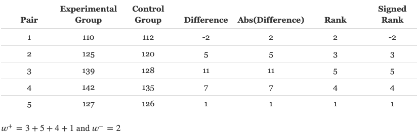
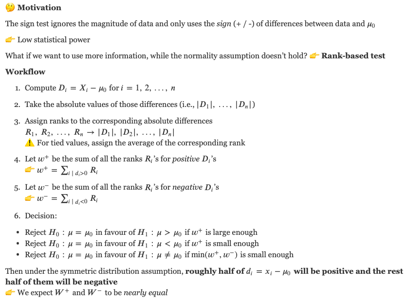
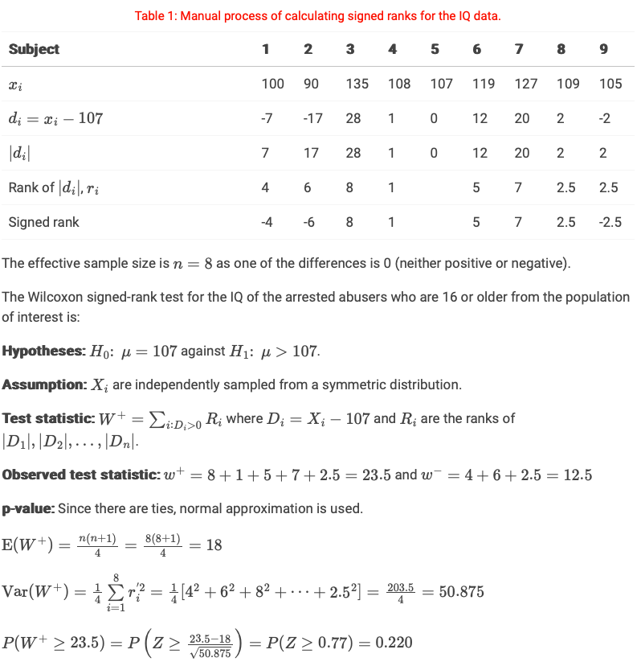
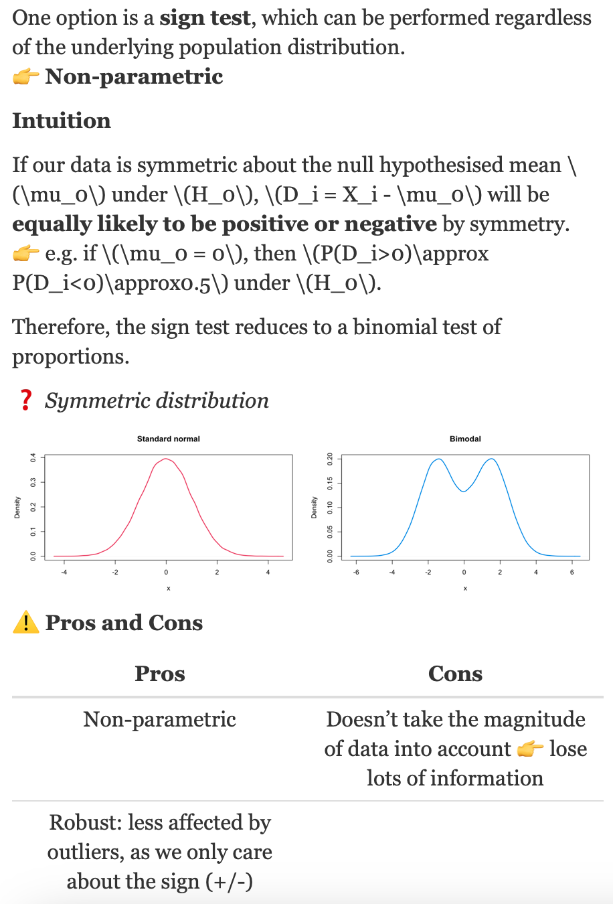
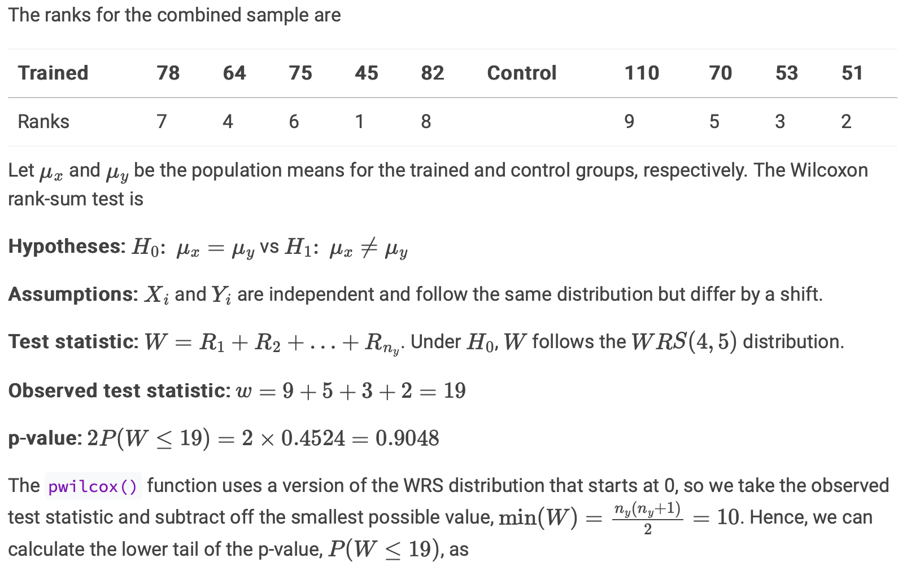

```{r setup, include=FALSE}
knitr::opts_chunk$set(echo = TRUE)
library(dplyr)
library(tidyr)
library(tidyverse)
library(knitr)
library(ggplot2)
```


# Lecture recap

##


# Group work

Answer the following questions in small groups.

Five sets of identical twins were selected at random from a population of identical twins. One child was selected at random from each pair to form an “experimental group.” These five children were sent to school. The other five children were kept at home as a control group. At the end of the school year the following IQ scores were obtained.

```{r}
Exp = c(110,125,139,142,127)
Con = c(112,120,128,135,126)
diff = Exp - Con
diff 
(mu = mean(diff))

# give ranks to the differences
rank(abs(diff),
     ties.method ="min")
```

### Which of the tests that we have considered so far in DATA2002 can be applied here? Why might you use one instead of the other?

An identical twin example is another case for the paired sample t-test. Identical twins are biologically similar to each other and they could affect each other by spending time together. Thus, they’re not independent of each other, meaning that we don’t have two independent populations. Rather, we have a pair of observations. Therefore, a paired sample t-test is appropriate.

Paired sample t-test, sign test applied to the differences, Wilcoxon signed rank test. The paired t-test is the most powerful test when the assumptions are met. The sign test is very robust, but not very powerful. The Wilcoxon signed rank test is a compromise between the paired t-test and sign test, as it is reasonably robust and powerful.

Garth:  
Paired t-test, sign test applied to the differences, Wilcoxon signed rank test. The paired t-test is the most powerful test when the assumptions are met. The sign test is very robust, but not very powerful. The Wilcoxon signed rank test is a compromise between the paired t-test and sign test, as it is reasonably robust and powerful.


$$H_0 : \mu_{E} - \mu_{C} = 0 \text{  vs.  } H_1 : \mu_{E} - \mu_{C} \neq 0$$
**Normality check** 

This is not usefull, since we have such a small dataset, we already know that the normality assumption will not hold. 
```{r}
# Quick visualisation using base R (not ggplot)
par(mfrow = c(1,2), mar = c(4,5,0.5,0.5))
boxplot(Exp, Con, names = c('Exp', 'Con'), ylab = "IQ")
boxplot(Exp - Con, ylab = 'Difference in life satisfaction\n(Old - Young)')
```

### If you were to proceed with a Wilcoxon signed rank test, calculate the test statistic.

We can write out the full procedure in a table as follows:
```{r, out.width="100%"}

```

### Under the null hypothesis of no difference in the mean IQ score between the experimental and control group, what is the expected value of the Wilcoxon signed rank test statistic?

Two sided test, therefore use: $W^+$

```{r}
sum_R = 5*(5+1)/4
# two groups:
sum_exp_pr_group = sum_R/2 # E(W^+)

```

If there was no difference between the experimental and control group we’d expect the ranks to be evenly distributed across the positive and negative differences.

The total sum of the ranks is: 1+2+3+4+5 = 15, so we’d expect to see $15/2=7.5$. I.e. $E(W^+) = E(W^-)=7.5$.


4. Let’s say we are testing a one sided alternative, i.e. the researchers hypothesised that the experimental group that were sent to school had higher IQs than the control group. If you had to guess which of the following p-values looks most reasonable for this example?

a. 0.0001
b. 0.9663
c. 0.0938 <= around 10%. This one
d. 0.4367

Don’t perform the test in R, just think about the observed test statistic, the expected test statistic and the sample size.

0.0938. There’s perhaps some evidence of a difference (the observed test statistic isn’t very close to 7.5), but we don’t have many observations so we can’t make a strong statement one way or the other - so we might expect to see a p-value that is smallish but not extremely small.

Strictly speaking, at the 5% level of significance we would not reject the null hypothesis that the average IQ is the same for the experimental and control group.

```{r}
twins = tibble::tribble(
     ~experimental,  ~control,
    110L, 112L,
    125L, 120L,
    139L, 128L,
    142L, 135L,
    127L, 126L
    )
wilcox.test(twins$experimental, twins$control, paired = TRUE, alternative = "greater")
```

# Lab Questions

## Drug abuse and IQ

### Lec recap: Wilcoxon signed-rank test

```{r, out.width="100%"}

```

In a study of drug abuse in a suburban area, investigators found that the median IQ of arrested abusers who were 16 years of age or older was 107. The following table show the IQs of a random sample of 9 persons from another suburban area.

```{r}
iq = c(100,90,135,108,107,119,127,109,105)

mu_obs = mean(iq)

diff_from_107 = 107 - iq
```

### Check for normality

Using the Wilcoxon signed-rank test can the researchers conclude that the mean IQ of arrested abusers who are 16 or older from the population of interest is higher than 107? Try calculating the test statistic by hand and use the normal approximation to identify the correct p-value from the options below. Confirm your calculations with R.

QQplot:  
Boxplot:  
- a little uneven


```{r}
par(mfrow = c(1,2), mar = c(4,4,1,1))
boxplot(iq, ylab = "IQ score")
qqnorm(iq, main = "")
qqline(iq)
```
It’s hard to be sure with only 9 observations. In the Q-Q plot in Figure above, the points are reasonably close to the line, so the normality assumption probably isn’t wildly inappropriate, but let’s err on the side of caution and go with a non-parametric test anyway.

The table below shows the differences $d_i=x_i-107$ and process of calculating the signed ranks.
```{r, out.width="100%"}

```

```{r}
dat = tibble(iq)
dat = dat |> mutate(
  d = iq - 107,
  abs_d = abs(d)
)
effective_dat = dat |> filter(d !=0 )
effective_dat$r = rank(effective_dat$abs_d)
w_plus = sum(effective_dat$r[effective_dat$d > 0])
w_minus = sum(effective_dat$r[effective_dat$d < 0])
n = nrow(effective_dat)
ew = n*(n+1)/4
varw = sum(effective_dat$r^2)/4
c(ew, varw)
```

```{r}
t0 = (w_plus - ew)/(sqrt(varw))
p_val = 1 - pnorm(t0)
c(t0, p_val)
```

Decision: Since p-value is greater than 0.05, we do not reject $H_0$. The data is consistent with $H_0$ that the IQ of the arrested abusers who are 16 or older from the population of interest is 107.
```{r}
wilcox.test(iq, mu = 107, alternative = "greater", correct = FALSE)

# alternatively
# wilcox.test(iq - 107, alternative = "greater", correct = FALSE)
```

## Weight gain

The weight of 5 pigs on diet X and 5 pigs on diet Y are

Diet $X : \{12, 16, 16, 12, 10\}$ and diet $Y : \{30, 12, 24, 32, 24\}$.

Test if there is a difference in weight using the Wilcoxon rank-sum test. 
In this test we only care about the rank. 

What is the corresponding p-value?

```{r}
A = c(12, 16, 16, 12, 10)
B = c(30, 12, 24, 32, 24)
dat = data.frame(
  yield = c(A, B),
  method = c(rep("A", length(A)),
             rep("B", length(B)))
)

library(ggplot2)
ggplot(wdat, aes(x = method, y = weight)) + 
  geom_boxplot() + 
  geom_point(size = 4, colour = "blue")
```


 Rank from 1 to 10 => continous
```{r}
wdat = wdat |> mutate(rank = rank(weight))
wdat
```

```{r}
w_X = wdat |> 
  filter(method == "X") |> 
  pull(rank) |> 
  sum()
w_X

sum_wdat = wdat |>
  group_by(method) |> 
  summarise(n = n(),
            w = sum(rank))
sum_wdat
```

```{r}
n_X = sum_wdat |> 
  filter(method == "X") |> 
  pull(n)
n_Y = sum_wdat |> 
  filter(method == "Y") |>
  pull(n)
# using the sums of the X sample
w_X = sum_wdat |> 
  filter(method == "X") |> 
  pull(w)
ew_X = n_X * (n_X + n_Y + 1)/2 
minw_X = n_X * (n_X + 1)/2 

# check what the expected value is
ew_X # = 27.5
# and 
minw_X # = 15
```


```{r}
# w_X : obs w_x
c(minw_X, w_X, ew_X) # w_A > ew_A

# looking in the upper tail, so use lower.tail = FALSE
2 * pwilcox(w_X - minw_X - 1, n_X, n_Y, lower.tail = FALSE)
```

### What if we use the sums of the ranks of the B sample?


```{r}
sum_wdat
# using the sums of the B sample
w_Y = sum_wdat |> 
  filter(method == "Y") |> 
  pull(w)
ew_Y = n_Y * (n_Y + n_X + 1)/2 
minw_Y = n_Y * (n_Y + 1)/2 
c(minw_Y, w_Y, ew_Y)
# now looking in the lower tail
2 * pwilcox(w_Y - minw_Y, n_Y, n_X)

```
Correct answer b.


## Donations

The University of Yendys is about to start a major philanthropic campaign and needs to pick the background colour for the emails that it sends out soliciting donations from alumni. The Advancement team knows from previous experiments that roughly the same proportion (~2%) of people donate regardless of the background colour of email, but they would like to investigate whether there is a difference in the amount donated if the email is sent with a yellow background (#FFB800) or an blue background (#0148A4).

An experiment is conducted where the university sends out 800 emails with a yellow background and 800 emails with a blue background (everything else about the emails was identical) to a random sample from their alumni database.

As expected, roughly 2% of recipients responded from each group. The data is given below. Test the null hypothesis that the mean donation amount is the same for each background colour against the alternative that the mean donation amount is different between the two colours.

```{r}
donations = data.frame(
  amount = c(150,80,150,450,110,240,70,350,720,190,
             130,50,240,210,130,130,250,280,50,50,
             210,100,200,300,550,190,300,800,170,
             600,120,220,270,190,400,140,330),
  treatment = c("Yellow","Yellow","Yellow","Yellow","Yellow",
                "Yellow","Yellow","Yellow","Yellow","Yellow",
                "Yellow","Yellow","Yellow","Yellow","Yellow",
                "Yellow","Yellow","Yellow","Yellow","Yellow",
                "Blue","Blue","Blue","Blue","Blue","Blue",
                "Blue","Blue","Blue","Blue","Blue","Blue",
                "Blue","Blue","Blue","Blue","Blue")
)
```


**Boxplot and Q-Q plot**
```{r}
# Fig 2
donations |> ggplot() + 
  aes(x = amount, y = treatment, fill = treatment) + 
  geom_boxplot() + 
  scale_fill_manual(values = c("Yellow" = "#FFB800", "Blue" = "#0148A4")) + 
  labs(x = "Donation", y = "Treatment") + 
  scale_x_continuous(labels = scales::dollar, limits = c(0,800)) + 
  theme_bw() + 
  theme(legend.position = "none")
```

```{r}
# Fig 3
donations |> ggplot() + 
  aes(sample = amount, colour = treatment) + 
  geom_qq_line() + geom_qq() + 
  facet_wrap(~treatment) + 
  scale_colour_manual(values = c("Yellow" = "#FFB800", "Blue" = "#0148A4")) + 
  labs(x = "Theoretical quantile", y = "Donation") + 
  scale_y_continuous(labels = scales::dollar) +
  theme(legend.position = "none")
```

It looks like maybe there’s a difference with blue looking to have higher a median than yellow. To test this formally, we need to pick the right test. The two possibilities are a two-sample -test or the Wilcoxon rank-sum test. The Q-Q plots in Figure 3 suggest that the observations don’t follow a normal distribution in either population because the points deviate from the line, particularly at the upper end of the distribution indicating skewed distributions. We can also see this skew in the boxplots in Figure 2 where the median is closer to the first quartile than the tail is longer at the upper end of the distribution than the lower end.

This suggests that we should be using a Wilcoxon rank-sum test: we have two independent samples that both seem to be similarly right skewed (both populations have the same distribution only differing by a possible shift).

```{r}
wilcox.test(amount ~ treatment, data = donations)
```

The p-value is 0.0509 which is very slightly larger than 0.05, however, for the purposes of a marketing campaign (this isn’t a life or death decision), this may well be sufficient evidence to make the decision to choose one colour over the other.

**Important: Data Snooping**  
It’s not appropriate for us to change the alternative hypothesis after we’ve visualised the data or after we’ve run the hypothesis test. The null and alternative hypothesis should be set before we collect the data.

If we wanted to formally conclude that emails with blue backgrounds result in higher average donations than emails with yellow backgrounds we would need to do another experiment, collect a new set of data and test the one sided hypothesis on that new sample.

**Note** 
If we ignored the skewed data and used a t-test anyway, in this case, we end up with a larger p-value. This is not always going to be the case and the p-value you get should not be the reason for picking one test over another.
```{r}
t.test(amount ~ treatment, data = donations)
```


## How fast can you type?

Ten executive assistants were selected at random from among the executive assistants at a large university. The typing speed (number of words per minute) was recorded for each executive assistant on two different brands of computer keyboards. The following results were obtained.
```{r}
x = data.frame(
  ea = c("Amy", "Bruce", "Carol", "Dion",
                "Ellen", "Fred", "Gwen", "Hugh",
                "Ingrid", "Kenneth"),
  brand_a = c(74, 80, 68, 74, 86, 75, 78, 69, 76, 77),
  brand_b = c(72, 86, 72, 70, 85, 73, 72, 65, 79, 75)
)
```

a. Add a column called `diff` to the data frame `x` that equals the difference between the Brand A speeds and the Brand B speeds. Also add a column `ranks` that has the ranks of the absolute values of the differences.

```{r}
x = x |> 
  mutate(
    diff = brand_a - brand_b, # differences
    ranks = rank(abs(diff)) # ranks of the absolute values of the differences
  )
```


b. Generate diagnostic plots to ascertain whether or not the differences are normally distributed. Discuss, with reference to the diagnostic plots, why you think the differences can or cannot be reasonably assumed to follow a normal distribution.

```{r}
# Boxplot
p1 = ggplot(x, aes(x = "", y = diff)) + 
  geom_boxplot() + theme_grey() + 
  labs(y = "Difference in typing speed (wpm)", x="")

# Q-Q plot
p2 = ggplot(x, aes(sample = diff)) + 
  geom_qq() + 
  geom_qq_line() + 
  theme_grey() + 
  labs(y = "Difference in typing speed (wpm)", x="")

# add them into onee plot
gridExtra::grid.arrange(p1, p2, ncol=2)
```
-Box plot: the median isn’t quite in the centre of the box and the top whisker is slightly shorter than the bottom whisker which indicates a left skew distribution. 

- Q-Q plot: the points all lie reasonably close to the diagonal line which suggests that the differences are approximately normally distributed.


### Lec recap: Sign test

What if the normality assumption doesn’t hold? 
$\to$ You can’t perform the t-test.

```{r, out.width="100%"}

```

c. Perform the **sign test** to determine if these data provide enough evidence at the 5% significance level to infer that the brands differ with respect to typing speed.

The sign test for the difference in typing speeds for executive assistants on two different brands of computer keyboards is

1. Hypotheses: $H_0 : p_+ 0.5$ vs. $H_1 : p_+ \neq 0.5$

2. Assumptions: Differences, $D_i = A_i - B_i$, are independent.

3. Test statistic: $T= \#(D_i > 0)$. Under $H_0, T \sim B(10,0.5)$.

4. Observed test statistic: $t_0 = \#(d_i > 0) = 7$.

5. p-value: 
$$\begin{align}
2P(X\geq 7) &= 2 \sum_{i=7}^{10} \binom{10}{i} 0.5^i \cdot 0.5^{10-i} \\
&= 2 \cdot 0.5^{10} \left[ \binom{10}{7} + \binom{10}{8} + \binom{10}{9} + \binom{10}{10}\right] \\
&= 2 \cdot 0.1719 = 0.3438 > 0.05
\end{align}$$

6. Decision: Since the p-value is greater than 0.05, we do not reject  and conclude that there is no difference in the typing speeds for executive assistants on two different brands of computer keyboards.

```{r}
t0 = sum(x$diff > 0) # 7
n = sum(x$diff != 0) # 10
c(t0, n)

2 * sum(dbinom(t0:n, n, 1/2)) # 0.34375

binom.test(t0, n)
```


d. Perform the **Wilcoxon signed-rank test** at the 5% level of significance.

1. Hypotheses: $H_0 : \mu_d = 0$ vs. $H_1 : \mu_d \neq 0$

2. Assumptions: Differences, $D_i = A_i - B_i$, are independently sampled from a symmetic distribution.

3. Test statistic: 
$$W^+ = \sum_{i:D_i >0} R_i$$
where $R_i$ are the ranks of $|D_1|, |D_2|, ..., |D_n|$.

4. Observed test statistic: $w^+ =33.5 , w^- = 21.5$:
$$w= \min(w^+ , w^-) = 21.5$$

5. p-value: $2P(W \leq 21.5)$.

- Since there are ties, we can't calculate an exaact p-value. Instead we can use the normal approximation, noting that 
$$E(W^+) = \frac{n(n+1)}{4} = \frac{10(10+1)}{4}=27.$$
$$Var(W^+) = \frac{1}{4} \sum_{i=1}^{10} r_i^2 = \frac{380.5}{4} = 95.125$$
$$\begin{align}
2P(W \leq 21.5) &= 2 P \left( Z \leq \frac{w- E(W^+)}{\sqrt{Var(W^+)}} \right) \\
&= 2 P \left( Z \leq \frac{ 21.5 - 27.5}{\sqrt{95.125}} \right)\\
&= 2 P \left( Z \leq -0.6152 \right) \\
&= 2 \cdot 0.2692 = 0.5384 > 0.05
\end{align}$$

6. Decision: As the p-value is greater than 0.05, we do not reject the null hypothesis. The data is consistent with $H_0$ that there is no difference in the typing speeds for executative assistants on two different brands of computer keyboards.


**The calculations**:  
```{r}
w_plus = sum(x$ranks[x$diff>0])
w_minus = sum(x$ranks[x$diff<0])
w = min(w_plus, w_minus)
n = length(x$ranks)
c(w_plus, w_minus, w, n)
```
```{r}
ew = n*(n+1)/4
varw = sum(x$ranks^2)/4
t0 = (w - ew)/sqrt(varw)
p_value = 2*pnorm(t0)
c(t0, p_value)
```

```{r}
wilcox.test(x$diff, correct = FALSE)
```


e. Use R to calculate the p-value for the paired t-test. Does the paired t-test come to the same decision as the sign test and Wilcoxon signed-rank test?

```{r}
t.test(x$diff)
```
Decision: The p-value for the paired t-test is 0.5309. Hence, we do not reject the null hypothesis at the 5% level of significance. This agrees with the conclusion from the sign test and the Wilcoxon signed-rank test.

```{r}
# or alternatively,
t.test(x = x$brand_a, y = x$brand_b, paired = TRUE)
```
The p-value for the paired t-test is 0.5309. Hence, we do not reject the null hypothesis at the 5% level of significance. This agrees with the conclusion from the sign test and the Wilcoxon signed-rank test.


f. Which test is better, the **sign test**, **Wilcoxon signed-rank test** or **paired t-test**? Why?

The Wilcoxon signed-rank test is generally preferred to the sign test as they both have the same assumption (symmetry) but the signed-rank test uses more information and is therefore more powerful (better able to reject the null when the null is false). 

The t-test is the most powerful test when the assumption of normality holds. With only 10 observations, it’s difficult to say that the normality assumption holds with any certainty, but it looks OK in the Q-Q plot. Hence the paired t-test is preferred. It is reassuring that all three tests come to the same decision.


## Rats teaching rats

From a group of nine rats available for a study of transfer of learning, five were selected at random and were trained to imitate leader rats in a maze. They were then placed together with four untrained control rats in a situation where imitation of the leaders enable them to avoid receiving an electric shock. The results (the number of trials required to obtain ten correct responses in ten consecutive trials) were as follows:

Trained rats: {78, 64, 75, 45, 82} and Controls: {110, 70, 53, 51}.

### Test if there is a difference in the number of trials required between the trained rats and the controls using the **Wilcoxon rank-sum test** given the following probabilities:

```{r}
data.frame(x = 0:10, 
           p = round(pwilcox(0:10, m = 4, n = 5), 4)) # probability
```

```{r, out.width="100%"}

```
```{r}
pwilcox(19 - 10, m = 4, n = 5) # 0.452

# or the whole p-value, 2P(W ≤ 19):
2 * pwilcox(19 - 10, m = 4, n = 5) # 0.905
```

**Decision**: Since the p-value is greater than 0.05, we conclude that the data is consistent with $H_0$. There are no differences in the number of trials required between the trained rats and the controls.

**In R**:
```{r}
rats = data.frame(
  trials = c(78, 64, 75, 45, 82, 110, 70, 53, 51),
  treatment = rep(c("Trained", "Control"), times = c(5, 4))
)
wilcox.test(trials ~ treatment, data = rats)
```


Since there are not ties, we cant calc p-value 
By hand in tut:
```{r}
T = c(78, 64, 75, 45, 82)
C = c(110, 70, 53, 51)

(mu_T = mean(T))
(mu_C = mean(C))
diff = mu_T-mu_C
diff 
```


```{r}
# Perform Wilcoxon rank-sum test
wilcox.test(T, C, exact = FALSE)
```
```{r}
A = c(78, 64, 75, 45, 82)     # n_A = 5
B = c(110, 70, 53, 51)        # n_B = 4
# Then N = 9 
dat = data.frame(
  yield = c(A, B),
  method = c(rep("A", length(A)),
             rep("B", length(B)))
)

dat = dat |> mutate(rank = rank(yield))
dat
```

```{r}

```


```{r}
w_A = dat |> 
  filter(method == "A") |> 
  pull(rank) |> 
  sum()

sum_dat = dat |>
  group_by(method) |> 
  summarise(n = n(),
            w = sum(rank))
sum_dat
```

So $w_y=19$. 

No matter which group you look at, the p-value will be the same. Ecxal same
9 observation within one group => 5 in one and 4 in one... ??

```{r}
n_A = sum_dat |> 
  filter(method == "A") |> 
  pull(n)
n_B = sum_dat |> 
  filter(method == "B") |>
  pull(n)

# using the sums of the A sample
w_A = sum_dat |> 
  filter(method == "A") |> 
  pull(w)
ew_A = n_A * (n_A + n_B + 1)/2 
minw_A = n_A * (n_A + 1)/2  # the other group

# check what the expected value is
ew_A # = 25
# and 
minw_A # = 15

c(minw_A, w_A, ew_A) # w_A > ew_A
```


