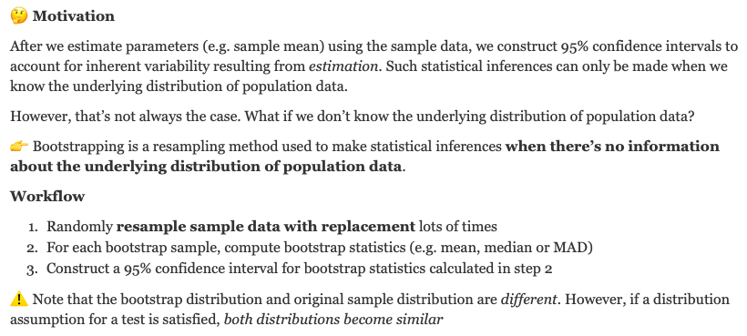
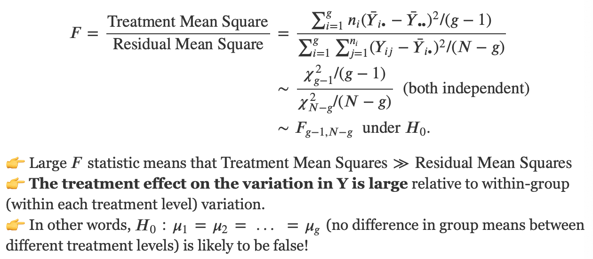
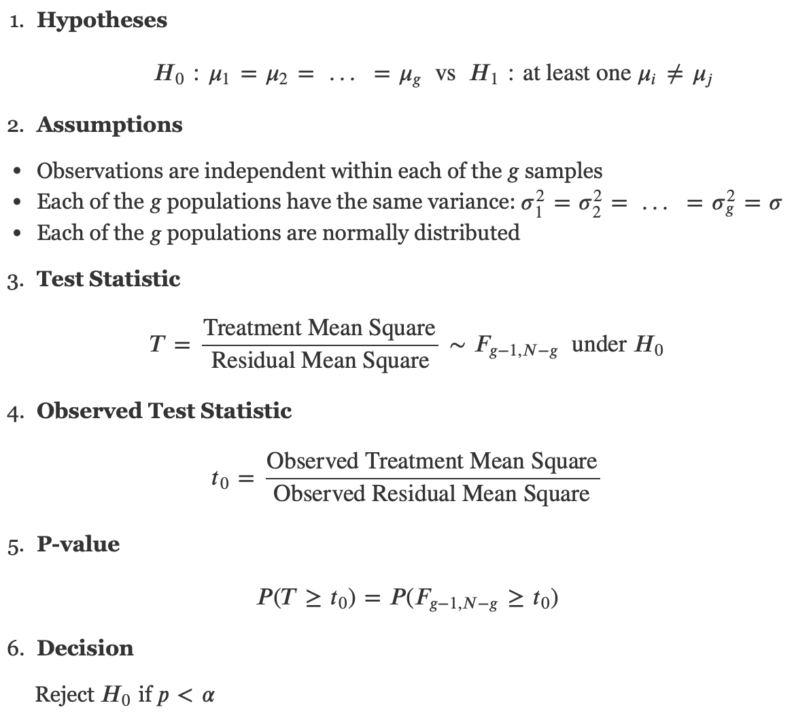
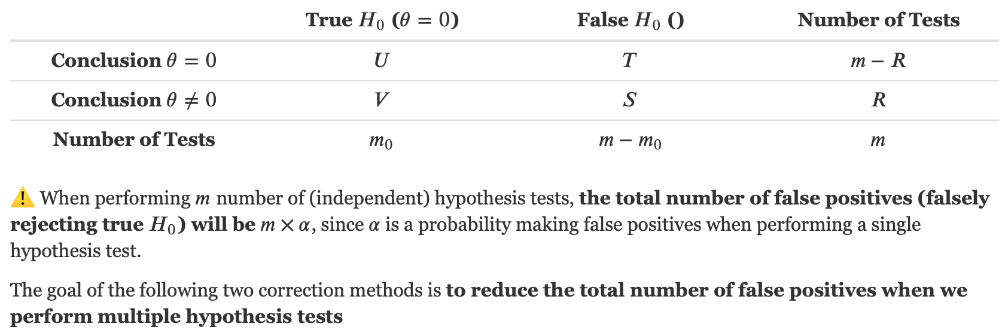
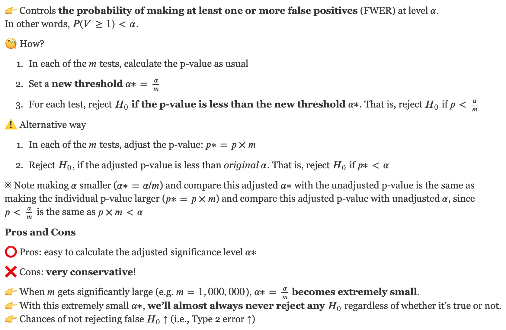
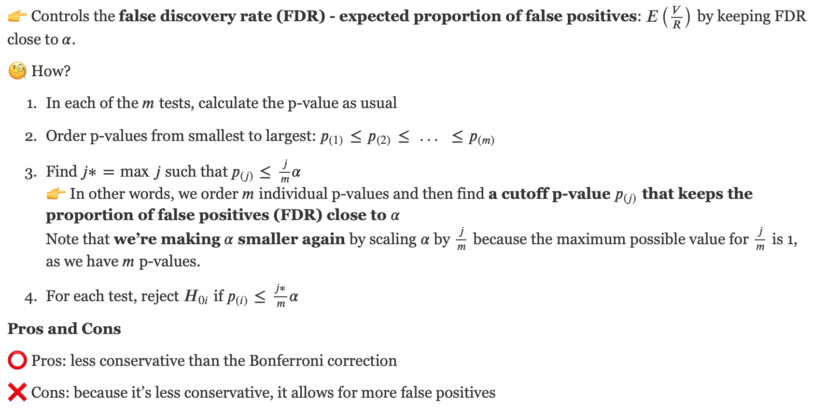

# Lecture Recap

```{r}
library(knitr)
```


## ANOVA

When we want to compare two population means, we can perform a two-sample $t$-test.

- What if we have more than 2 independent groups?

ANOVA: a generalisation of the two-sided two-sample $t$-test.

### ANOVA Decomposition

```{r, out.width="100%"}

```

### The $F$ statistic
```{r, out.width="100%"}

```

### One-way ANOVA
```{r}

```

## Multiple Testing
```{r, out.width="100%"}

```

### Bonferroni Correction
```{r, out.width="100%"}

```

### Benjamini-Hochberg Correction
```{r, out.width="100%"}

```


# Lab Questions

If a light is flickering but at a very high frequency, it appears to not be flickering at all. Thus there exists a “critical flicker frequency” where the flickering changes from “detectable” to “not detectable” and this varies from person to person.

The critical flicker frequency and iris colour for 19 people were obtained as part of a study into the relationship between critical frequency flicker and eye colour.

## Critical Flicker Frequency
```{r}
library(tidyverse)
flicker = read_tsv("https://raw.githubusercontent.com/DATA2002/data/master/flicker.txt")
glimpse(flicker)
```
already in long format

a. **Generate side by side box plots as well as normal Q-Q plots for the flicker data. Do your plots support the assumptions required for an ANOVA test to be valid? Explain.**

```{r}
ggplot(flicker, aes(x = Colour, y = Flicker, fill = Colour)) +
  geom_boxplot() +
  labs(y = "Critical flicker frequency", x = "Eye colour")
```
The box plots look symmetric, there are no outliers and they have similar spread. 
We can conclude that each population looks approximately normal and the equal variance assumption is reasonable.


```{r}
ggplot(flicker, aes(sample=Flicker)) +
  geom_qq() + geom_qq_line() + 
  facet_wrap(vars(Colour)) +
  labs(y = "Critical flicker frequency", x = "Theoretical quantile")
```
The QQ-plots look OK, in that the points are reasonably close to the line.


b. **Use the `aov()` function to perform an ANOVA test for the equality of means flicker level across each of the three eye colours.**

Use the ANOVA workflow provided in the tut solution

```{r}
flicker_anova = aov(Flicker ~ Colour, data = flicker)
flicker_anova
```

```{r}
summary(flicker_anova)
```

```{r}
pf(4.802, 2, 16, lower.tail = FALSE)
```


c. **Using the output, write out the hypothesis test in full.**
Be sure to state the null and alternative hypothesis, assumptions, test statistic (with distribution), observed test statistic, p-value and an appropriate conclusion.


1. \textbf{Hypotheses:} $H_0: \mu_1 = \mu_2 = \mu_3$ vs $H_1: \text{at least one } \mu_i \neq \mu_j$.

2. \textbf{Assumptions:} Observations are independent within each of the 3 samples. Each of the 3 populations have the same variance:
$$\sigma_1^2 = \sigma_2^2 = \sigma_3^2 = \sigma$$ 
Each of the 3 populations are normally distributed (or the sample sizes are large enough such that you can rely on the central limit theorem).

3. \textbf{Test statistic:} 
$$T = \frac{\text{Treatment Mean Sq}}{\text{Residual Mean Sq}} \quad \text{ Under } H_0, \,\ T \sim F_{g-1, N-g}$$
where $g = 3$ is the number of groups and $N = 19$ is the total sample size.

4. \textbf{Observed test statistic:} 
$$t_0 = \frac{11.499}{2.394} = 4.8$$

5. \textbf{p-value:} 
$$P(T \geq t_0) = P(F_{2, 16} \geq t_0) = 0.023$$

6. \textbf{Decision:} As the p-value is less than 0.05 we reject the null hypothesis and conclude that the population mean flicker sensitivity of at least one eye colour is significantly different to the others.


## Blonds

In an investigation into the relationship between tolerance to pain and hair colour, men and women of various ages were divided into 4 groups based on hair colour and given a pain sensitivity test. Each person’s “pain threshold score” (higher score means higher pain tolerance) is recorded in the file blonds.txt.

```{r}
pain = read_tsv("https://raw.githubusercontent.com/DATA2002/data/master/blonds.txt")
glimpse(pain)
```

a. **Change `HairColour` so that the ordering is preserved from lightest to darkest.**
Hint use: `factor()`

The order of these should be changed from alphabetical, there is a natural ordering, from lighter to darker. This is done as follows:
```{r}
pain = pain |> mutate(
  HairColour = factor(HairColour, levels = c("LightBlond", "DarkBlond", "LightBrunette", "DarkBrunette"))
)
levels(pain$HairColour)
```


b. **Generate box plots and Q-Q plots to check the ANOVA assumptions.**

```{r}
ggplot(pain, aes(x = HairColour, y = Pain)) + 
  geom_boxplot() + 
  labs(y = "Pain threshold score", x = "Hair colour")
```
```{r}
ggplot(pain, aes(sample = Pain)) + 
  geom_qq() + geom_qq_line() +
  facet_wrap(~HairColour) + 
  labs(y = "Pain threshold score", x = "Theoretical quantile")
```
It is hard to say anything conclusive about the ANOVA assumptions with so few observations in the different groups. Should be careful not to read too much into box plots with so few observations, but the spreads look roughly similar. 
Also with the QQ-plots, can’t be too conclusive because of the low sample size, but the points are all reasonably close to the lines so the normality assumption doesn’t appear to be violated.


c. **What do the box plots suggest about the null hypothesis that pain thresholds are the same regardless of hair colour?**

A shocking apparent effect! Looks like as hair colour darkens, pain thresholds decrease.

d. **Test this hypothesis formally using ANOVA. Does there seem to be a relationship between hair colour and pain threshold?!**


Benjamini-H:
- a lot less conservative, but still is

```{r}
pain_anova = aov(Pain ~ HairColour, data = pain)
summary(pain_anova)
```

1. \textbf{Hypotheses:} $H_0: \mu_1 = \mu_2 = \mu_3 = \mu_4$ 
vs $H_1: \text{ at least one } \mu_i \neq \mu_j$.

2. \textbf{Assumptions:} Observations are independent within each of the 4 samples. Each of the 4 populations have the same variance:
$$\sigma_1^2 = \sigma_2^2 = \sigma_3^2 = \sigma_4^2 = \sigma$$ 
Each of the 4 populations are normally distributed.

3. \textbf{Test statistic:} 
$$T = \frac{\text{Treatment Mean Sq}}{\text{Residual Mean Sq}} \quad \text{ Under } H_0, \,\ T \sim F_{g-1, N-g}$$

where $g = 4$ is the number of groups and $N = 19$ is the total sample size.

4. \textbf{Observed test statistic:} 
$$t_0 = \frac{453.6}{66.9} = 6.791$$

5. \textbf{p-value:} 
$$P(T \geq 6.791) = P(F_{3, 16} \geq 6.791) = 0.004$$

6. \textbf{Decision:} As the p-value is less than 0.05 we reject the null hypothesis and conclude that the population mean pain threshold of at least one hair colour group is significantly different to the others.


The code and results below will be introduced in more detail in future weeks, but it provides a more overall way of assessing these assumptions. It’s a similar idea, looking for roughly constant spread in the “residuals” across the range of “fitted values” and looking to check if the (standardised) residuals lie close to the dashed line in the normal Q-Q plot. In this case the spread of the residuals looks roughly similar across the range of fitted values (indicating the equal variance assumption is OK) and the points all lie reasonably close to the dashed line in the Q-Q plot indicating that the normality assumption is well satisfied.

```{r}
library(ggfortify)
autoplot(pain_anova, which = c(1,2))
```


## Hedenfalk data

The package `sgof` has a data set Hedenfalk (Conde & Una Alvarez, 2020). 

A shocking apparent effect! Looks like as hair colour darkens, pain thresholds decrease.

```{r}
# install.packages("sgof")
library(sgof)

# To find out more about this data set.
# ?Hedenfalk 
glimpse(Hedenfalk)
```
a. **How many p-values are in the data set?**
```{r}
length(Hedenfalk$x) 
```
We will have 3170 p-values


b. **Generate a histogram of the (unadjusted) Hedenfalk p-values.**

```{r}
ggplot(Hedenfalk, aes(x = x)) + 
  geom_histogram()
```
A slightly improved histogram, where the bins don’t go below 0 or above 1:
```{r}
ggplot(Hedenfalk, aes(x = x)) + 
  geom_histogram(boundary=0, binwidth = 0.05) + 
  labs(x = "Unadjusted p-value", y = "Count") + 
  theme_grey()
```

c. **How many (unadjusted) p-values are significant at the 5% level of significance? What proportion of all p-values in the data set is this?**


```{r}
sum(Hedenfalk$x < 0.05) # 605

mean(Hedenfalk$x < 0.05) # 0.1909
```


d. **Why is it a good idea to consider adjusted p-values?**

With so many tests, it’s likely we’re seeing a substantial number of false positives. With 3170 p-values, even if none of them should be rejected (i.e. even if in reality the null hypothesis is true for all tests), we’d expect to see $3170 \cdot 0.05 = 158.5$  significant p-values by chance alone.

e. **Using `p.adjust()` find the Bonferroni and BH p-values. Plot histograms of each and find the number of significant results after adjustment for both.**

```{r}
Hedenfalk = Hedenfalk |>
  mutate(
    bonf_p = p.adjust(x, method = "bonferroni"),
    BH_p = p.adjust(x, method = "BH")
  )
p1 = Hedenfalk |> 
  ggplot() + aes(x = bonf_p) + 
  geom_histogram(boundary = 0, binwidth = 0.05) +
  theme_grey() + 
  labs(x = "Bonferroni adjusted p-value",
       y = "Count") + 
  scale_y_log10()
p2 = Hedenfalk |> 
  ggplot() + aes(x = BH_p) + 
  geom_histogram(boundary = 0, binwidth = 0.05) +
  labs(x = "BH adjusted p-value",
       y = "Count") + 
  theme_grey()
gridExtra::grid.arrange(p1,p2,ncol=2)
```


```{r}
# sum(Hedenfalk$bonf_p < 0.05) mean(Hedenfalk$bonf_p < 0.05)
# sum(Hedenfalk$BH_p < 0.05) mean(Hedenfalk$BH_p < 0.05)
Hedenfalk %>%
    summarise_at(.vars = vars(bonf_p, BH_p), # for each of the two columns: bonf_p and BH_p
                 .funs = list(n_sig = function(x) sum(x < 0.05), # find the number of Bonferroni/BH adjusted p-values less than unadjusted alpha = 0.05
                              prop_sig = function(x) mean(x < 0.05))) %>% # find the proportion of Bonferroni/BH adjusted p-values less than unadjusted alpha = 0.05
    knitr::kable()
```
f. **Comment on the difference between the Bonferroni method and the BH method.**

- The Bonferroni method seeks to control the family wise error rate, and can be very conservative. 
    - Bon: p-value * num of test
        - very conservative
        - Cap at 1 mark, since dens cannot > 1
        
- The Benjamini–Hochberg (BH) method looks to control the false discovery rate and tends to allow more false positives. 
    - less conservative
    
We can see this in the results, where the Bonferroni method finds only two significantly differentially expressed genes whereas the BH procedure identified 94.

**Extra**

The following code will prove that we can adjust $\alpha$ and compare adjusted $\alpha ^*$ with unadjusted p-values for the Bonferroni correction method.

```{r}
Hedenfalk %>%
    summarise_at(.vars = vars(x), # for unadjusted p-values x
                 .funs = list(n_sig = function(x) sum(x < 0.05/3170), # find the number of unadjusted p-values (x) less than adjusted alpha (0.05/3170)
                              prop_sig = function(x) mean(x < 0.05/3170))) %>% # find the proportion of unadjusted p-values (x) less than adjusted 0.05 (0.05/3170)
    knitr::kable()
```

As you can see, the total number of false positives after the Bonferroni correction is the same as above (see bonf_p_n_sig and bonf_p_prop_sig in question e above).
