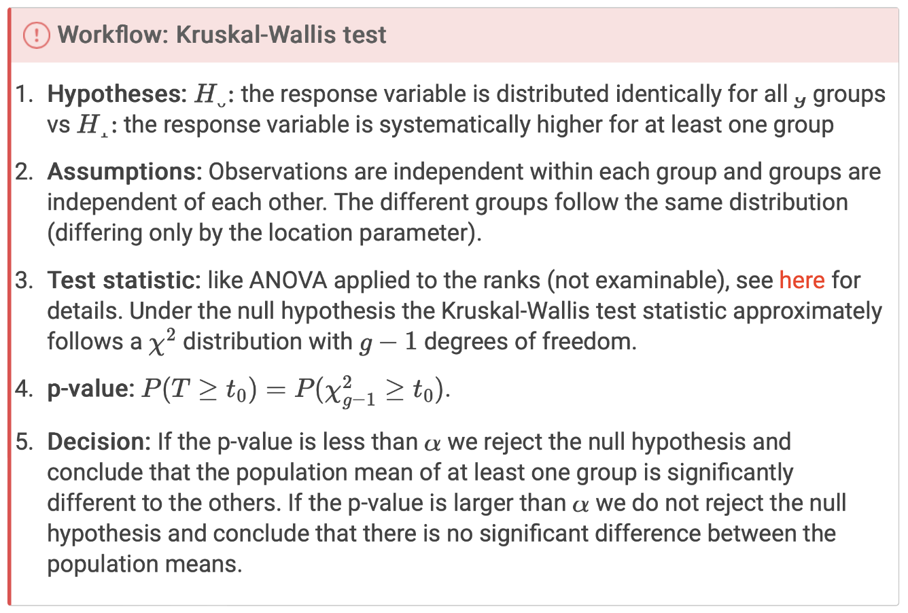

```{r setup, include=FALSE}
knitr::opts_chunk$set(echo = TRUE)
```

```{r}
library(readr)
library(tidyverse)
library(dplyr)
library(ggplot2)
```


**What can we do when ANOVA assumptions fail?**


# What happens when assumptions fail?

## Assumptions underlying ANOVA (and related methods)
Underlying all of these are the assumptions that
- each sample is from a normal population;
- all population variances are equal.
    so all populations are identical up to possible location shifts
What do we do if these assumptions are not reasonable?

**Possible violations**
- the normality might be ok, but equal variances might not be;
- the normality might not be ok, but the “identical up to location shifts” assumption might be ok. 


# Relaxing the equal variance assumption

## Wolf River data
The data in the file `wolfriver.csv` contains 30 measurements on each of two chemicals, Aldrin and HCB.
  (10 at 3 depths: Bottom = 1; Middepth = 2; Surface = 3) 

$H_0$ : Concentration is constant across different depths.
$H_1$ : Concentration is NOT constant across different depths.
```{r}
wolf = read_csv("https://raw.githubusercontent.com/DATA2002/data/master/wolfriver.csv")
glimpse(wolf)
```


```{r}
wolf = wolf |> mutate(
  Depth = case_when(
    Depth == 1 ~ "Bottom",
    Depth == 2 ~ "Middepth",
    Depth == 3 ~ "Surface"
  )
)
wolf |> count(Depth)
```

Plot below:

Variance?
  hint: equal variance aassumptions is not met

```{r}
# reformat dataset
wolf_long = wolf |> 
  pivot_longer(cols = Aldrin:HCB, names_to = "chemical", # has the name of the org data
         values_to = "concentration") 
# plot reformatted df
ggplot(wolf_long, aes(x = Depth, y = concentration)) + 
  geom_boxplot() + facet_wrap(~chemical) 
```

Residuals: no major issues 

```{r}
ggplot(wolf_long, aes(sample = concentration)) + 
  geom_qq() + geom_qq_line() + facet_grid(chemical ~ Depth)
```


### Assumptions?

- Both sets of boxplots suggest a different spread in each group
      normality is probably ok (points close to line in Q-Q plots)

A scatterplot (tracking both chemicals together) reveals something interesting:
  bi-variate outliers: sits aapart from the rest of the dataa
  
```{r}
ggplot(wolf) + aes(x = HCB, y = Aldrin, shape = Depth, colour = Depth) + 
  geom_point(size = 5)
```


### Outliers ?!
There are 3 possible “outliers” (actually bivariate outliers, really):
```{r}
wolf |> arrange(HCB-Aldrin)
```
…they might not have been so apparent when considering separately.
```{r}
wolf |> mutate(
  diff = HCB - Aldrin
) |> 
  ggplot() + aes(x = "", y = diff) + 
  geom_boxplot(outlier.size = 5) + 
  coord_flip()
```

## Assumptions fail_ all pairwise comparisons

Since equal variance assumption is not met, we can condier all pairwise Welch tests + Bonferroni correction


$$T=\frac{\bar{X} - \bar{Y}}{\sqrt{\frac{S^2_X}{m}  + \frac{S^2_Y}{n}}} \sim \text{ approx } t_{d^*(m,n,\sigma_X, \sigma_Y)} \text{ under } H_0$$
### Welch test pairwise comparisons (unadjusted)
```{r}
#Middepth vs Surface
t.test(wolf$Aldrin[wolf$Depth=="Middepth"],
       wolf$Aldrin[wolf$Depth=="Surface"])$p.value

# Middepth vs Bottom
t.test(wolf$Aldrin[wolf$Depth=="Middepth"],
       wolf$Aldrin[wolf$Depth=="Bottom"])$p.value

# Surface vs Bottom
t.test(wolf$Aldrin[wolf$Depth=="Surface"],
       wolf$Aldrin[wolf$Depth=="Bottom"])$p.value
```

Since we are doing 3 pairwise comparisons, we multiply the “unadjusted” p-values by 3 to get “adjusted-for-multiplicity” p-values.

The smallest of these can be used as a test that all (population) means are equal:
```{r}
t.test(wolf$Aldrin[wolf$Depth=="Surface"],
       wolf$Aldrin[wolf$Depth=="Bottom"])$p.value

3 * t.test(wolf$Aldrin[wolf$Depth=="Surface"],
           wolf$Aldrin[wolf$Depth=="Bottom"])$p.value
```
This is a perfectly valid p-value for testing the “global” or “overall” hypothesis that all means are equal (assuming all 3 populations are normal, but with possibly different variances).

```{r}
pairwise.t.test(wolf$Aldrin, wolf$Depth, 
                p.adjust.method = "none", pool.sd = FALSE)
```


```{r}
pairwise.t.test(wolf$Aldrin, wolf$Depth,
                p.adjust.method = "bonferroni", pool.sd = FALSE)
```


### Simultaneous confidence intervals
To obtain a set of 3 simultaneous Bonferroni-style 95% confidence intervals, we compute 3 individual $(1-\frac{0.05}{3}) \cdot 100 = 98.3%$ intervals

Of course, this does not include 0 because the adjusted p-value <0.05!

```{r}
# adjusted confidence level:
# for the fact that we are doing this test for 3 different comparisons
cl = 1-(0.05/3)
```

Middepth vs Surface:
```{r}
t.test(
  wolf$Aldrin[wolf$Depth=="Middepth"], 
  wolf$Aldrin[wolf$Depth=="Surface"], 
  conf.level = cl)$conf.int
```


Middepth vs Bottom
```{r}
t.test(
  wolf$Aldrin[wolf$Depth=="Middepth"],
  wolf$Aldrin[wolf$Depth=="Bottom"],
  conf.level = cl)$conf.int
```

Surface vs Bottom
```{r}
t.test(
  wolf$Aldrin[wolf$Depth=="Surface"],
  wolf$Aldrin[wolf$Depth=="Bottom"],
  conf.level = cl)$conf.int
```


# Relaxing the normality assumption

Under the formal ANOVA assumptions:
  · each population is normal
  · variances are the same

$H_0$ reduces to
  All observations come from the same normal distribution

A weaker set of assumptions at least under the null hypothesis is that
  All observations come from the same distribution

## The powerful tool of conditioning

-  A common tool in testing is to condition on an “ancillary” statistic:
  “ancillary statistic” just means a statistic that does not tell us anything useful.

- A familiar example is the **sign test**:
  we usually condition on the number $N$ of non-zeroes (i.e. we ignore the ties)
    non-zeros tells us nothing -> throw them away

- Then, p-values are in fact conditional probabilities, e.g. for a one-sided sign test based on the number $S$ of positive signs, the p-value is
  pvalue cond on non-zeros
$$P(S\geq s|N=n)=P(B(n,0.5)\geq s)$$
kinda looks like the monte carloo contingency tables, where we cond on thee column totals 

### Conditioning on the combined sample
- If we combine all the groups into one combined sample (i.e. throw away the labels) then the remaining “data” tells us nothing about differences between groups i.e. what we are interested in.

- In this sense, the combined sample is an “ancillary statistic”.

- Once we condition on the combined sample, the only remaining “randomness” is the allocation of observations to groups.

- Under the null hypothesis of “no differences between groups” all possible allocations are equally likely.

### Enumerating all possible allocations: exact p-values
- We can (in principle) compute an exact conditional p-value for any “sensible” statistic under this particular null hypothesis.

- There are actually
$$\frac{N!}{n_1!n_2!...n_g!}$$
different possible allocations of the $N$ total observations into groups of size $n_1,n_2,...,n_g$.

- We can (in principle) compute the value of the statistic under each possible allocation.
- Since each such value is equally likely under the null hypothesis, we can use this “sampling distribution” to compute a p-value.

- Suppose the statistic is $T$, the observed value is $t_0$ 
  large t_0 => evidence against the null hypothesis.
  
- The exact conditional p-value is a simple proportion:
$$P(T \geq t_0 | \text{ combined sample }) = \frac{\text{ #allocatons with } T\geq t_0}{\text{ total #allocations }}$$
- Unfortunately, unless the sample sizes are very small,
    the total number of allocations is MASSIVE;
    computing the value of the statistic over all possible allocations is not feasible.

- Fortunately, we can estimate this proportion by taking a sufficiently large random sample from the “population of all possible allocations”.
 
## Permutation tests

**Permute**: sampling without replacement
we are only shuffling not bootstraaping (with replacement)

In R, if the data is represented as a data frame with
    observations in one column and
    groups indicated by a factor in another column
    
  then is it easy to obtain a “random” allocation:
    simply randomly permute the observation vector, keeping the factor vector fixed.
    · reallocating --> getting a random label/group for each observation
    · for the $t$-test, it doesn't really matter if you permute the observation vector or the factor vector.    
        => in practice often easier to permute the observation vector AND what we focus on

Do this a large number of times.

The “observed proportion” of the times the statistic exceeds $t_0$ becomes an estimate of the “exact” p-value.


## Rugby analysis
The lengths of time of passages of play were recorded in 10 games featuring the New Zealand national team (the “All Blacks”):
the first 5 games under the old rules
the last 5 games under the new rules

Situation: 
  special kind of constrast where you pull together games of the first and last 5 games.
  
Boxplot below: **Not normal** = is right skewed
- median closer the the first quantile than the third in most of them
- very long tail above the third quantile => tail off to the right
- BUT kinda all look to have the same distribution and the same right skewed tail.

```{r}
rugby = read_tsv("http://www.statsci.org/data/oz/rugby.txt")
# Notice factor -> treats each game as its own instead of a numerical variable.
ggplot(rugby) + aes(x = factor(Game), y = Time) + 
  geom_boxplot() + coord_flip()
```

### *F*-test?

`aov`(continuous variable ~ categorical variable)

```{r}
# again declare Game as a factor st. it is a categorical variable
# Time is a continuous variable
rugby_anova = aov(Time ~ factor(Game), data = rugby)
anova(rugby_anova)

# org F statistic
anova(rugby_anova)[1,4] # 3.89
```

### Check for normality
Highly NOT normal. 
strong departure from the normal straight line => not normal
But there is a lot of observation, which might save us due to the central limit theorem (CLT).

```{r}
library(ggfortify)
autoplot(rugby_anova, which = 2) # generate usefull plot
```

### The broom package

```{r}
rugby_anova = aov(Time~factor(Game), data = rugby)
mod_sum = broom::tidy(rugby_anova) # makes a pretty df
mod_sum
```


```{r}
library(knitr)
# pull out the F statistic from the broom df
mod_sum$statistic[1] # 3.89

mod_sum |> kable(format = "markdown", digits = c(0,0,0,1,3,4))
```
The R function `sample()`, with only one vector argument, returns a permutation of that vector:
```{r}
set.seed(1)
x = 1:5
sample(x)
```
The following loop takes a sample of size B from all possible permutations and computes the value of the $F$-statistic:
```{r}
B = 2000
f_stat = vector(mode = "numeric", length = B)
for (i in 1:B){
  permuted_anova = aov(sample(rugby$Time)  ~ factor(rugby$Game))
  f_stat[i] = broom::tidy(permuted_anova)$statistic[1]
}
```

Our ANOVA would use the theoretical dist, without during a permutation test. 
Theoretical matches the permuted dist very good. interesting even though the data didn't pass the normality check.

This tells us: The ANOVA $F$-test is pretty resilient to that normality assumptiion fail. 
  due to CLT (large number of samples)
  
```{r}
hist(f_stat, probability = TRUE, breaks = 40)
curve(df(x, 9, 969), add = TRUE, col = "red") # theoretical F distribution
```

The $F$-distribution density is drawn over the histogram and the fit looks pretty good.

Our estimate of the exact conditional p-value is obtained as follows:
```{r}
t_0 = broom::tidy(rugby_anova)$statistic[1]
t_0

mean(f_stat >= t_0)
```

So of the 2000 random permutations 0 gave an $F$-ratio bigger than (or equal to) 3.89.

**We have avoided making any normality assumption here!**
This says a lot about the robustness of the $F$-test…
- the conditional distribution is very close to the corresponding $F$-distribution.

# Using ranks

pull all data together, then rank them, then do a F test on the ranks


## Kruskal-Wallis test

This is performed by
    replacing each observation by its “global” rank;
    then computing the $F$-ratio as usual on the ranks.
A p-value can be obtained
    using a permutation test approach or
    a “large-sample” $\chi^2$ approximation can also be used

- generalization of the Rank-Sum test

## Rugby data (ranks)

Boxplot: dist over all ranks
- check the mean over all ranks for the different games
```{r}
rugby = rugby |> ungroup() |> mutate(Time_rank = rank(Time)) # rank of org data
# ungroup: during it over all data togehter into one sample
ggplot(rugby, aes(x = factor(Game), y = Time_rank)) + 
  geom_boxplot() + coord_flip()
```
Perform the AVONA: 
  Is there a significant diff between the ranks of the games? 
  Is at least one games mean different from the others?
  
```{r}
rugby_kw = aov(Time_rank ~ factor(Game), data = rugby)
broom::tidy(rugby_kw)
```


## Kruskal-Wallis test statistic (Rugby)


The traditional approach to the Kruskal-Wallis test uses a test statistic that is computed as a ratio (like the $F$-test)
        this denominator is not random (it is the same regardless of the allocation).
$$T= \frac{ \text{Treatment SS of the ranks} }{ \text{Sample variance of the ranks} }$$
When $H_0$ is true, it has an approximate $\chi^2_{g-1}$ distribution.
$H_0$ : No difference between the group means.


### Performing the KW test

“Manually” computing the test statistic:
```{r}
rugby_rank_anova = aov(Time_rank ~ factor(Game), data = rugby)
rank_treat_SS = broom::tidy(rugby_rank_anova)$sumsq[1]
t0 = rank_treat_SS/var(rugby$Time_rank) # 30.68072

pchisq(t0, df = 10 - 1, lower.tail = FALSE) # 0.0003357678
```

This statistic is computed (and a resultant “approximate” p-value is obtained) via the R function `kruskal.test()`:
```{r}
# unranked org continuous `Time` variable
# the categorical Game variable
kruskal.test(Time ~ factor(Game), data = rugby)
```
Very small p-value 0.0003 < 0.05 => reject $H_0$ and conclude that not all means are the same.

### Workflow

isn't gonna work when you have one group that has a very large variance and one group that has aa very small variance => dist of the two group would not be the same

```{r, out.width="100%"}

```

## Permuted ranks
The permutation test approach is valid for any “sensible” statistic;
  - it only assumes the same distribution in each group under the null hypothesis.
  
What of the “sensible statistic”?
  - If the data are truly normal (group has same dist, not to rid), the $F$-statistic makes sense;
  - is it still “sensible” if the normality assumption is being relaxed?
  - could also do a permutation test using the Kruskal-Wallis statistic. If you are not comportable with the norm assumpton.


## Rugby data (KW permutation test)
when the assumption for the ANOVA is not meet.
if you dont have equal variance, you can fall back on during a pairwise t-test.
if you dont have normally distributed data or have outliers, you can use a rank based approch (e.i. KW test) or of cause a permutation test (ala t-test earlier on.)

```{r}
set.seed(1)
B = 2000
Game = rugby$Game
Time = rugby$Time
kw_stat = vector("numeric", length = B)
for (i in 1:B){
  # find the rank of the permuted `sample(Time)` ~ cat Game.
  aov_rank = aov(rank(sample(Time)) ~ factor(Game)) 
  # extract the KW test statistic of the ANOVA done on the permuted ranks. 
  kw_stat[i] = broom::tidy(aov_rank)$statistic[1] 
}

original_rank_mod = aov(rank(Time)~factor(Game))

t0 = broom::tidy(original_rank_mod)$statistic[1] # 3.487

# p-value
mean(kw_stat >= t0) # 0.0005
```


