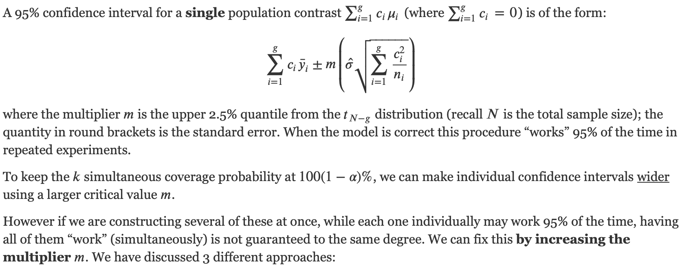
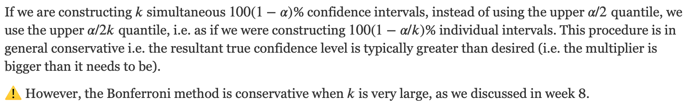
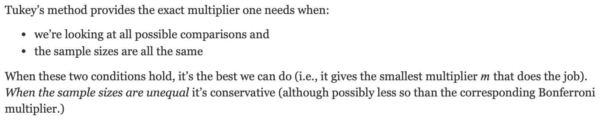
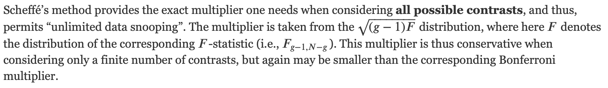
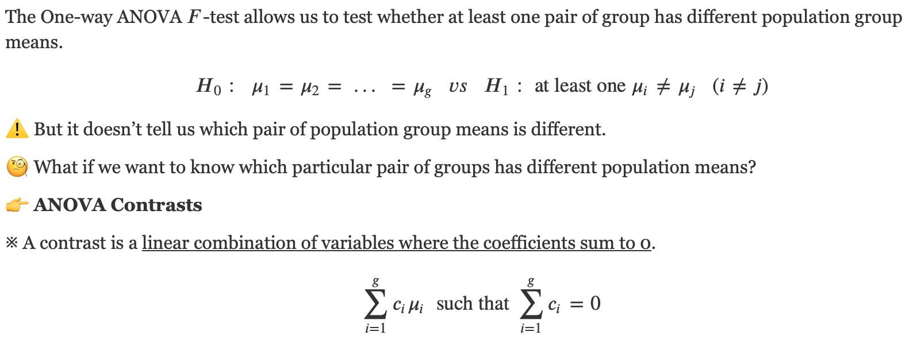
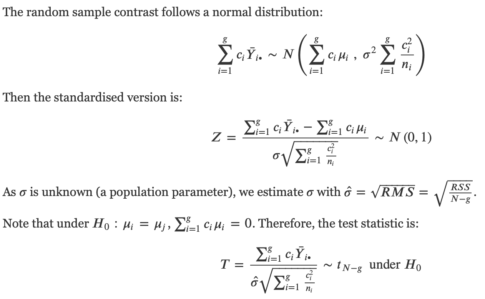
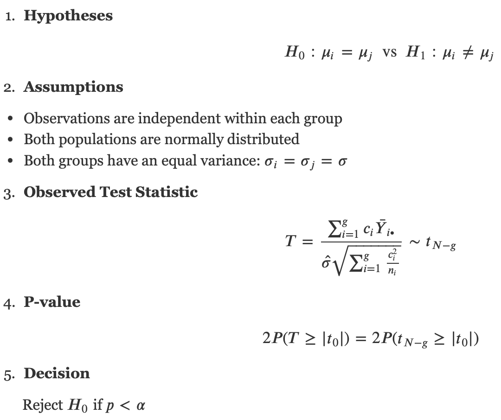
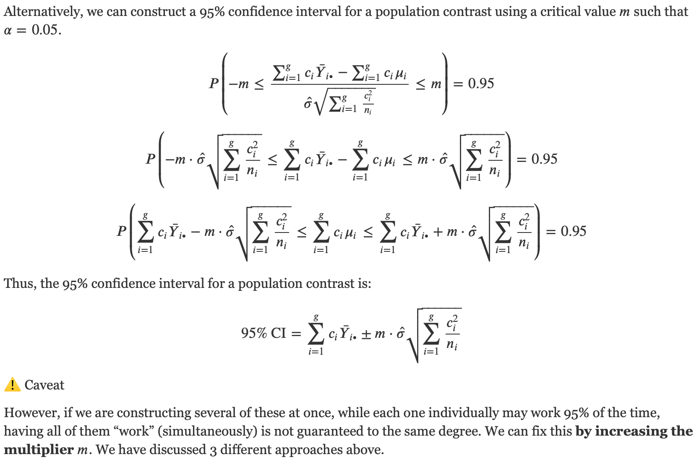

# Lecture Recap: multiple comparisons

## Simultaneous confidence intervals

```{r, out.width="100%"}

```

ANOVA: more than 3 groups
- group means
- 3 diff methods for correction

Implementation:
```{r}
# this code won't actually run, we haven't defined y or group
library(emmeans)
one_way = aov(y ~ group)
one_way_em = emmeans(one_way, ~ group)

# Bonferroni's method:
one_way_pairs = contrast(one_way_em, method = "pairwise", adjust = "bonferroni")
# alternatively, can use pairs(
one_way_pairs = pairs(one_way_em, adjust = "bonferroni")
plot(one_way_pairs)

# Tukey's method:
contrast(one_way_em, method = "pairwise", adjust = "tukey")

# Scheffe's method:
contrast(one_way_em, method = "pairwise", adjust = "scheffe")
```


### The Bonferroni method
  - making $\alpha$ smaller, 

```{r, out.width="100%"}

```

### Tukey’s method
  - all sample sizes are the same
  
```{r, out.width="100%"}

```

### Scheffé’s method
  - Data snooping
  - multiplier taken from $\sqrt{\bar{(g-1)F}}$
  
```{r, out.width="100%"}

```

## ANOVA Contrasts

```{r, out.width="100%"}

```

## Two-sample $t$-test for an ANOVA contrast

```{r, out.width="100%"}

```
### $t$-test

```{r, out.width="100%"}

```

### Confidence Interval

```{r, out.width="100%"}

```


# Lab Questions

## Pain thresholds

Recall the pain/hair colour data. Below we change the factor order from alphabetical to “lightest to darkest”:
```{r}
library(tidyverse)
pain = read_tsv("https://raw.githubusercontent.com/DATA2002/data/master/blonds.txt")
glimpse(pain)
```

```{r}
pain = pain |> mutate(
  HairColour = factor(HairColour, levels = c("LightBlond", "DarkBlond", "LightBrunette", "DarkBrunette"))
)
levels(pain$HairColour)
```


Assumptions:
- doesnot seem to be normal dist
```{r}
ggplot(pain, aes(x = HairColour, y = Pain)) + 
  geom_boxplot() + theme_grey()
```


```{r}
pain_sum = pain |> group_by(HairColour) |> 
  summarise(
    n = n(),
    ybar = mean(Pain),
    stand_error = sd(Pain)
  )
pain_sum
```


```{r}
ni = pain_sum |> pull(n)
ybar_i = pain_sum |> pull(ybar)

# ANOVA F-test
pain_aov = aov(Pain ~ HairColour, data = pain)
summary(pain_aov)
```

4 groups
--> you can perform F-test, which tells you if there is one pair that has a significant different group mean


1. **Compute the standard error of each pairwise difference (note, there are only two different standard errors over the $\biom{4}{2}=6$ pairwise differences).**

We have 4 groups, 

$$T=\frac{\sum^g_{i=1} c_i \bar{Y}_{i\bullet}}{\hat{\sigma} \sqrt{\sum^g_{i=1} \frac{c_i^2}{n_i}}} \sim t
_{N-g}$$


$\bar{Y}_{i\bullet}$ : Sample mean

you can set $c_i = 0$ for the groups that you are not really interested in. 
  - You are aallowed to do that for all $c_i$.
if $c_1 = 1$, then $c_2 = -1$, since all $\sum c_i = 0$ 


```{r}
sig.hat = sqrt(66.8)
sig.hat
```

Note that $RMS=66.8$ from the ANOVA table above. This is the estimated $\hat{\sigma}$.

Where both sample sizes are 5, the standard error is then
```{r}
se.55 = sig.hat * sqrt(2/5) # sqrt(1/5 + 1/5)
se.55
```
When one sample is 4 and one sample is 5 (i.e. any comparison with `LightBrunette`), the standard error is
```{r}
se.45 = sig.hat * sqrt((1/5) + (1/4))
se.45
```

2. **Compute $t$-statistics for all 6 pairwise comparisons.** 
The output below may be useful:
```{r}
diff_mat = outer(ybar_i, ybar_i, "-")
diff_mat
```
We can get a matrix of standard errors using the fancy `outer()` command
```{r}
se.mat = sig.hat * sqrt(outer(1/ni, 1/ni, "+"))
se.mat
```

The “ratio” below gives the $t$-statistics:
```{r}
diff_mat/se.mat
```


3. **Using the output below and the Bonferroni method, determine the appropriate multiplier for constructing 6 simultaneous confidence intervals at both the 95% and 99% confidence levels.**

```{r}
upper.tail.area = c(0.05, 0.025, 0.05/6, 0.025/6, 0.01, 0.005, 0.01/6, 0.005/6) # possible adjusted significance levels when k = 6
t.quantile = qt(1 - upper.tail.area, df = 15) # get a quantile value for each adjusted significance level
cbind(upper.tail.area, t.quantile)
```

```{r}
# For a 95% confidence interval, the multiplier is
qt(1-0.025/6, df=15)

# For a 99% confidence interval, the multiplier is
qt(1-0.005/6, df=15)
```

4. **Which differences are significant at the**

Any  $t$-statistics bigger (in absolute value) than the 95% multiplier are significant at the 5% level.
This includes:
- `LightBrunette--LightBlond`
- `DarkBrunette--LightBlond``

The latter is also bigger than the 99% multiplier, so it is also significant at the 1% level.

5. **Check your answers using the emmeans package. Do your conclusions change if you use Tukey’s or Scheffe’s method?**


```{r}
library(emmeans)
pain_em = emmeans(pain_aov, ~HairColour)
# pairs(pain_em, adjust = 'bonferroni')
bonf = contrast(pain_em, method = "pairwise", adjust = "bonferroni")
plot(bonf) + theme_bw() + geom_vline(xintercept = 0)
```


## Tablet

This data contains the level of chlorpheniramine maleate in tablets from seven labs (Rice, 1995, pp. 443–444). The purpose of the experiment was to study the consistency between labs. For each of four manufacturers, composites were prepared by grinding and mixing together tablets in order to measure the amount of chlorpheniramine maleate. Seven labs were asked to make 10 determinations on each composite (Kirchhoefer, 1979). The data for the 7 labs are provided in the file tablet1.txt.

We start by reading in the data and use the pivot_longer() function from the tidyr package to reshape the data from wide to long format.
```{r}
library(tidyverse)
tablet = read_tsv("https://raw.githubusercontent.com/DATA2002/data/master/tablet1.txt")
glimpse(tablet)
```


```{r}
tabdat = tablet |> 
  pivot_longer(cols = everything(), names_to = "lab", values_to = "measurement")
glimpse(tabdat)
```


boxplot would not be okay - violated

```{r}
tabdat |> 
  ggplot() + 
  aes(x = lab, y = measurement, fill = lab) + 
  geom_boxplot() + 
  theme_classic() + 
  labs(y = "Chlorpheniramine maleate (mg)",
       x = "Lab", fill = "")
```
The boxplots in Figure 1 show some differences in the medians. Are these differences significant? We can address this by asking a variety of questions.


1. **Is the mean level of chlorpheniramine maleate in tablets from Lab 1 different from 4.0 mg? State the null hypothesis.**

```{r}
t.test(tablet$Lab1, mu = 4)
```

One sample $t$-test.
$$H_0 : \mu_1 = 4 \text{ vs. } H_1 : \mu_1 \neq 4$$


2. **Is the mean level of chlorpheniramine maleate in tablets from Lab 1 different from that from Lab 3?**

```{r}
t.test(tablet$Lab1, tablet$Lab3)
```
Two sample $t$-test.
$$H_0 : \mu_1 = \mu_3 \text{ vs. } H_1 : \mu_1 \neq \mu_3$$

3. **Perform a one-way ANOVA to test if the mean levels of chlorpheniramine maleate differ across the seven labs.**

```{r}
lab_anova = aov(measurement ~ lab, data = tabdat)
summary(lab_anova)
```

1. \textbf{Hypotheses:} $H_0: \mu_1 = \mu_2 = \mu_3 = \mu_4 = \mu_5 = \mu_6 = \mu_7$ vs $H_1: \text{at least one } \mu_i \neq \mu_j$.

2. \textbf{Assumptions:} 

- Observations are independent within each of the 7 samples
- Each of the 7 populations have the same variance: 
$$\sigma_1^2 = \sigma_2^2 = \sigma_3^2 = \sigma_4^2 = \sigma_5^2 == \sigma_6^2 = \sigma_7^2 \sigma$$ 
- Each of the 7 populations are normally distributed


4. \textbf{Observed test statistic:} 
$$t_0 = \frac{0.020790}{0.003673} = 5.66$$

5. \textbf{p-value:} 
$$P(T \geq t_0) = P(F_{6, 63} \geq 5.66) < 0.001$$

6. \textbf{Decision:} As the p-value is very small we reject the null hypothesis and conclude that the population mean level of chlorpheniramine maleate of at least one lab is significantly different to the others.

4. **Obtain a Q-Q plot of the residuals and comment on the validity of the ANOVA assumptions.**

```{r}
library(ggfortify)
autoplot(lab_anova, which = c(1, 2)) + theme_classic()
```

In the left hand plot, we’re looking for changes in the spread of the residuals across the range of fitted values. It looks like there might be a bit more variation in the center than at the extremes, but the side by side boxplots earlier showed that the constant variance assumption was more or less OK in that the spreads of data was not wildly different between the labs.

In the right hand plot, there are a few observations at the lower end that deviate from the diagonal line, so the residuals may not be normally distributed. However, the discrepancy is not large and the total sample size is large enough that the central limit theorem will ensure our inferences are at least approximately valid.

We could generate these plots “manually” by extracting the fitted values and residuals from the ANOVA object.

```{r}
ass_df = data.frame(fitted = lab_anova$fitted.values, # get fitted values
                    resids = lab_anova$residuals) # get residuals

p1 = ass_df %>%
  ggplot() + 
  aes(sample = resids) + # plot residuals
  stat_qq() + # draw dots
  stat_qq_line() + # draw the diagonal line
  theme_classic() +
  labs(x = "Theoretical quantiles", y = "Residuals")

p2 = ass_df %>%
  ggplot() + 
  aes(x = fitted, y = resids) +
  geom_point() + 
  theme_classic() +
  labs(x = "Fitted values", y = "Residuals")

gridExtra::grid.arrange(p2, p1, ncol = 2)
```


5. **Perform pairwise post hoc tests to determine which labs are significantly different.**

```{r}
lab_em = emmeans(lab_anova, ~ lab)

lab_pair = contrast(lab_em, method = "pairwise", adjust = "bonferroni")

lab_pair %>% 
  data.frame() %>% 
  filter(p.value < 0.1) %>%
  knitr::kable(digits = 4)
```


```{r}
plot(lab_pair) + 
  theme_bw() + 
  labs(x = "Pairwise mean difference") + 
  geom_vline(xintercept = 0)
```

6. **Use a rank based approach to testing for a difference between the means of the 7 labs.**

non parametric test, when the normality assumption does hold

Kruskal-Wallis Test

👉 Used when the normality assumption doesn’t hold.

Workflow

- Combine the data.

- With this new pooled data, rank the observations and assign global ranks to the corresponding observations.

- Assuming observations are independent of each other and different groups follow the same distribution, perform the usual ANOVA 𝐹-test on the ranks.

```{r}
kruskal.test(measurement ~ factor(lab), data = tabdat)
```

1. **Hypothesis**
$H_0 :$ the level of chlorpheniramine maleate is distributed identically for across all labs (and therefore the mean level is the same across all labs) 
$H_1 :$ the level of chlorpheniramine maleate is systematically higher for at least one lab

1. **Assumptions**
- Observations are independent within each group and groups are independent of each other.
- The different groups follow the same distribution (differing only by the location parameter).

3. **Test Statistic**
$$T = \frac{\text{Treatment SS of the ranks}}{\text{Variance of all the ranks}} \sim \chi^2_{g-1} \text{ under } H_0$$

4. **Observed Test Statistic**
$$t_0 = 29.606$$

5. **P-value**
$$P(T\geq t_0) = P(\chi_6^2 \geq 29.606) < 0.001$$

6. **Decision**
As the p-value is very small we reject the null hypothesis and conclude that the population mean of at least one group is significantly different to the others.

**Post hoc tests**

If we wanted to go on and perform nonparametric post hoc tests, we could apply the Bonferroni method to all pairwise comparisons tested by Wilcoxon rank-sum tests.

```{r}
pairwise.wilcox.test(x = tabdat$measurement, g = factor(tabdat$lab), p.adjust.method = "bonferroni")
```


Again, we see that Lab 1 is significantly different to Labs 4, 5 and 6. However, now Lab 3 is also significantly different to Lab 4.

**Final comments**

The Kruskal-Wallis test makes no assumption of normality and thus has a wider range of applicability than a standard one-way ANOVA. It is especially useful in small-sample situations. Because data are replaced by their ranks, outliers will have less influence on this nonparametric test than on the ANOVA test. In some applications, the data might be considered more like a ranking than a measurement - for example, in wine tasting, judges often rank the wines - which makes the use of the rank based tests very natural.

7. **Use a permutation based approach to testing for a difference between the means of the 7 labs.**

```{r}
B = 2000
f_stat = vector(mode = "numeric", length = B)
for (i in 1:B) {
    permuted_anova = aov(sample(tabdat$measurement) ~ factor(tabdat$lab)) # perform the ANOVA F-test on the permuted data 
    f_stat[i] = broom::tidy(permuted_anova)$statistic[1] # extract the F-test statistic
}
t_0 = broom::tidy(lab_anova)$statistic[1]
hist(f_stat)
```

```{r}
mean(f_stat >= t_0)
```

