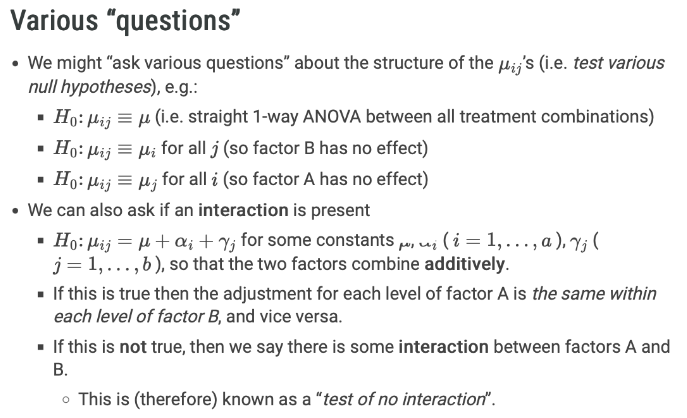
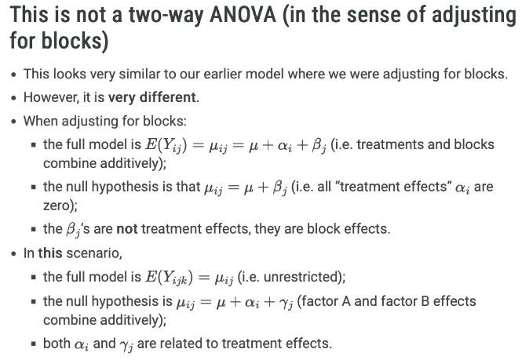
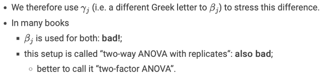

```{r setup, include=FALSE}
knitr::opts_chunk$set(echo = TRUE)
```

## General setup

**Factor** = response variable
- "treatment" could me a combination of factors. Which raise:
    · Each factor has an effect?
    · is the effect of one factor the same across all levels of the other factor(s)?

# Two-factor ANOVA
$$\{y_{ijk} : i=1,...,a \,\ ; \,\ j=1,...,b \,\ ; \,\ k=1,...,n \}$$
where $y_{ijk}$ is the $k$-th observation receiving the treatment combination corresponding to level $i$ of factor A and level $j$  of factor B.
There are $n$ observations receiving each treatment combination.
- We assume $a=b$
The **full model** is that $y_{ijk}$  is the value taken by $Y_{ijk} \sim N(\mu_{ij}, \sigma^2)$.
- each treatment combination has specific mean and a common variance component.


For each $i=1, ..., a$, $j=1, ..., b$, $k=1, ..., n$, $y_{ijk}$ is the $k$-th observation receiving level $i$ of factor A and level $j$ of factor B and is modelled as the value taken by the random variable,
$$Y_{ijk} \sim N(\mu_{ij}, \sigma^2)$$
and all random variables are assumed independent.

```{r, out.width="100%"}

```
```{r, out.width="100%"}

```
```{r}

```

$$\mu_{ij} = \mu + \alpha_i + \gamma_j + (\alpha \gamma)_{ij}$$

For the **full model** follows some kind of scaled chi-squarred distribution:
$$\sum_{i=1}^a \sum_{j=1}^b \sum_{k=1}^n (Y_{ijk} - \bar{Y}_{ij\bullet})^2 \sim \sigma^2 \chi^2_{ab(n-1)}$$
  where total sample size: $N = abn$, 
  #groups: $g = ab$
  df: $N-g = abn - ab = ab(n-1)$
  

For the **no interaction model** follows some kind of scaled chi-squarred distribution:
$$\sum_{i=1}^a \sum_{j=1}^b  n(\bar{Y}_{ij\bullet} - \bar{Y}_{i\bullet \bullet} - \bar{Y}_{\bullet j \bullet} + \bar{Y}_{\bullet \bullet \bullet})^2 \sim \sigma^2 \chi^2_{(a-1)(b-1)}$$
And the test statistic for the $H_0$ follows a F-dist: $$\sim F_{(a-1)(b-1), ab(n-1)}$$
  if it is true.


# Examples

## Poisons and antidotes

In a famous paper Box & Cox (1964) analyse an experiment where one of each of 3 poisons and 4 antidotes were administered to a sample of 4 animals, giving 48 observations all together (4 observations on each of the 12 treatment combinations).
    - The response was survival time.   
    - They showed the reciprocal of the survival time was an appropriate transformation to use on the response.
- The aim of the study was to determine how each antidote affected survival in the presence of each poison.
- This is a “3-by-4 factorial experiment”.

```{r}
# install.packages("BHH2")
library(dplyr)
library(tidyverse)
data("poison.data", package = "BHH2")
glimpse(poison.data)
```

```{r}
# rename treat as antidote to avoid confusion with the general term "treatment"
poison.data = poison.data |> 
  rename(antidote = treat) # rename 'treat' to antidote
glimpse(poison.data)
```

### Visualising the data

Plot 1:
- The variance is much less for groups with lower means. 
    "the variability gets lower as well" -> violates ANOVA assumption
    
**A transformation is clearly needed here to satisfy normality, equal variance assumptions.**

```{r}
# plot 1
poison.data |> ggplot() + 
  aes(x = interaction(poison, antidote), y = y) +
  geom_boxplot() + 
  theme_classic(base_size = 15) + 
  labs(y = "Survival time")

# plot 2. added some stuff
poison.data |> ggplot() + 
  aes(x = poison, y = y) +
  geom_boxplot() + 
  theme_classic(base_size = 15) + 
  facet_wrap(~antidote, ncol = 4) + 
  labs(y = "Survival time")
```
**Transformation**
$$\text{survival time}^* = \frac{1}{\text{survival time}}$$
The reciprocal transformation is much better;
  while spreads still differ somewhat, they don’t get systematically smaller with smaller mean.

```{r}
poison.data = poison.data |> 
  mutate(inv_survival = 1/y) # the reciprocal of the original survival time y 
poison.data |> ggplot() + 
  aes(x = poison, y = inv_survival) + 
  geom_boxplot() + 
  theme_classic(base_size = 15) + 
  facet_wrap(~antidote, ncol = 4) + 
  labs(y = "1/survival time")
```

### Interrogating data


```{r}
# Recall we have two factors, poison with 3 levels:
levels(poison.data$poison)
# and antidote with 4 levels:
levels(poison.data$antidote)
```

Given the two separate factors poison and antidote, 
  the R object poison:antidote is a new factor which has as its levels every possible poison:antidote combination:
```{r}
poison.data$poison:poison.data$antidote
```

This factor indicates the 12 groups/levels in the “big 1-way ANOVA” where each poison:antidote combination is a different treatment;
there are 4 observations on each “treatment”.
```{r}
# n = #observations
poison.data |> 
  group_by(poison, antidote) |> 
  count()
```

We could fit the full model (the “big 1-way ANOVA”):
```{r}
a1 = aov(inv_survival ~ poison:antidote, data = poison.data)
anova(a1)
```
There is a clear treatment effect
- Note there are 47 df in total:
    11 for treatments
    36 for residuals

### A better approach
A full, appropriate two-factor ANOVA table can be produced by using an appropriate formula:
  fit `poison:antidote` after fitting the main effects (*interaction effect*):
```{r}
# inv_survival: transformed survival time (y1/)
# poison:antidote is the interaction effect
a3 = aov(inv_survival ~ poison + antidote + poison:antidote, 
         data = poison.data)
summary(a3)
```
Results:
  p-value for the no-interaction model is 0.387. quite large = no significant interaction effect and thus we will not reject the null hypotheses that the $(\alpha \gamma)_{ij}$ are all jointy = 0. 
  
The sum of squares for `poison:antidote` here only contains the variation explained by treatments not already explained by main effects.

This provides a convenient partition of the “big 1-way ANOVA” treatment sum of squares (11 df in total) into 3 contributions:
    2 df for poison main effect;
    3 df for antidote main effect;
    6 df for the interaction effect.


### Alternate formula for two-factor ANOVA

An equivalent formula which includes main effects followed by interactions is given as follows:
```{r}
# poison * antidote = poison + antidote + poison:antidote
summary(aov(inv_survival ~ poison * antidote, data = poison.data))
```

- The poison and antidote main effects are significant (i.e. there is a significant difference between the levels of each treatment group).


### Interaction plots

The mean responses for each treatment combination:
```{r}
sum_dat = poison.data |> group_by(poison, antidote) |> 
  summarise(mean = mean(inv_survival),
            n = n())
sum_dat
```
These two plots are just opposite each other. 

- Do these lines look roughly parallel to each other within each plot?
    YES! This fits with the conclusion of not rejecting the $H_0$.
```{r}
# x = antidote
sum_dat |> 
  ggplot(aes(x = antidote, y = mean,
             group = poison, 
             linetype = poison,
             colour = poison)) + 
  geom_point() + geom_line() + theme_grey()

# x = poison
sum_dat |>
  ggplot(aes(x = poison, y = mean,
             group = antidote, 
             linetype = antidote,
             colour = antidote)) + 
  geom_point() + geom_line() + theme_grey()
```

**Using emmeans**
The emmip() function from the emmeans package can do this for us:
```{r}
library(emmeans)
emmip(a1, poison ~ antidote) +
  theme_grey()

emmip(a1, antidote ~ poison) +
  theme_grey()
```


### Comparing poisons (ad hoc)

We determined that there is no interaction between poison and antidote, so we can perhaps go ahead and compare different poison (to each other) and also compare antidote treatments (antidote) (to each other).

```{r}
poison.data |> 
  ggplot(aes(x = poison, y = inv_survival)) +
  geom_boxplot() + 
  theme_grey()

poison.data |> 
  ggplot(aes(x = antidote, y = inv_survival)) +
  geom_boxplot() +
  theme_grey()
```


### Pairwise difference $t$-statistics

- do all the poison have the same mean?
- do all the antidote have the same mean?

```{r}
# We drop the interaction term, since it werent significant. 
a2 = aov(inv_survival ~ poison + antidote, data = poison.data)
# Thus now without interaction

emmeans(a2, ~ poison) |> contrast(method = "pairwise", adjust = "none")
# Res:  means are sig diff (very small p-values)

emmeans(a2, ~ antidote) |> contrast(method = "pairwise", adjust = "none")
# Res: most are significant except B-D and C-D
```

### Assessing significance
"Correction for multiple testing"


### Bonferroni method

We know:
- we are doing 9 tests
    where 6 is from the antidotes and 4 from the poissons

```{r}
p_emm = contrast(emmeans(a2, ~poison), method = "pairwise", adjust = "bonferroni")
p_emm
```
Res: Take each p-value and multiply by 3 
fx: $I-II: 0.0308 \cdot 3 = 0.0924$

```{r}
a_emm = contrast(emmeans(a2, ~antidote), method = "pairwise", adjust = "bonferroni")
a_emm
```
Res: Take each p-value and multiply by 3 
fx: $A-C: 0.0414 \cdot 6 = 0.2484$

**Add them together** -> tell the emmeans package that we did 9 tests.
which mean that the original p-value should me multiplied by 9.

Poison
I-II: no sig diff
I-III, II-III: there is a sign diff  => thus maybe III does something

Antidote:
A-C, C-D: no sig diff
all others: sig diff

```{r}
pa_emm = update(p_emm + a_emm)
pa_emm
```
- For poison: the I-III and II-III differences are highly significant, while the I-II has an adjusted p-value of about 0.09 (not really significant).

- For antidote: all differences are highly significant except B-D (not at all significant) and A-C (p=0.06).

```{r}
plot(pa_emm) + theme_bw(base_size = 15) + geom_vline(xintercept = 0) + 
  labs(x = "Estimated pairwise mean difference", 
       caption = "95% confidence intervals adjusted for\nmultiple testing using the Bonferroni method")
```


## Paper planes

- Mackisack (1994) has the results from an experiment where statistics students launched paper planes in a controlled environment, controlling for various factors, including
    Paper quality: 1 (80gsm) and 2 (50gsm);
    Plane design: 1 (High-performance glider) and 2 (Incredibly simple glider).

Treatment combinations: 80H, 80I, 50H, 50I

- The response was distance travelled in mm.

- Four “flights” were conducted at each of the 4 treatment combinations.

- Do either Paper or Plane (or both) have any impact on the distance “flown”?

- This is a “2-by-2 factorial experiment”.

```{r}
planes = read_tsv("https://raw.githubusercontent.com/DATA2002/data/master/planes.txt")
glimpse(planes)
```

```{r}
planes = planes |> 
  # Rename
  mutate(
    Paper = case_when(
      Paper == 1 ~ "80gsm",
      Paper == 2 ~ "50gsm"
    ),
    Plane = case_when(
      Plane == 1 ~ "HiPerf",
      Plane == 2 ~ "Simple"
    )
  )

glimpse(planes)
```

### Visualising the data

```{r}
# Marginal box plots
p1 = ggplot(planes, aes(x = Plane, y = Distance)) + 
  geom_boxplot() + labs(y = "Distance (mm)") 
p2 = ggplot(planes, aes(x = Paper, y = Distance)) + 
  geom_boxplot() + labs(y = "Distance (mm)") 
gridExtra::grid.arrange(p1, p2, ncol = 2)
```

```{r}
p3 = p1 + facet_wrap(~ Paper) + coord_flip()
p4 = p2 + facet_wrap(~ Plane) + coord_flip()
gridExtra::grid.arrange(p3, p4, ncol = 1)
```


### Interrogating data

First, we check the “big 1-way ANOVA”:
```{r}
summary(aov(Distance ~ Paper:Plane, data = planes))
```
Results:
- p-value of the biig 1-way ANOVA = 0.001 < 0.05 => re would reject that all comb has the same mean.
- There is a strong Treatment effect.

Now we partition the treatment sum of squares into main effects and interactions:
```{r}
plane_aov = aov(Distance ~ Paper * Plane, data = planes)
summary(plane_aov)
```
Results:
- reject the `paper:plane` null hypothesis. -> there is something going on in the comb of level i of fac A and level j of fac B. 
- There is a strong interaction effect.
- Note the large p-values for the main effects.
    · Are they significant? No.
    · Should they be dropped from the model: absolutely not!
- If an interaction is significant, we must retain the full model.


### Interaction plots

- Recall that there was a strong interaction effect.
- What would be expect to see here?

```{r}
plane_sum_dat = planes |> 
  group_by(Plane, Paper) |> 
  summarise(mean = mean(Distance))
plane_sum_dat
```

```{r}
plane_sum_dat |> 
  spread(key = Plane, value = mean)
```

**Paper planes interaction plots** 
- non parallel lines => some interaction our variables
  - partic: for `HiPerf` you would use 
      if goal: to go further => use `50gsm` 
  - partic: for `Simple` you would use 
      if goal: to go further => use `80gsm`

outcome/goal depends on the paper
```{r}
plane_sum_dat |>
  ggplot(aes(x = Paper, y = mean,
             group = Plane, 
             linetype = Plane)) + 
  geom_point(size = 4) +
  geom_line(size = 1.5) + 
  theme_grey()

plane_sum_dat |> 
  ggplot(aes(x = Plane, y = mean,
             group = Paper, 
             linetype = Paper)) + 
  geom_point(size = 4) +
  geom_line(size = 1.5) + 
  theme_grey()
```


**Using emmeans**
The emmip() function from the emmeans package can do this for us:
```{r}
emmip(plane_aov, Plane ~ Paper) +
  theme_grey()

emmip(plane_aov, Paper ~ Plane) +
  theme_grey()
```

**Crossing traces: interaction**
- The traces cross dramatically, highlighting the strong interaction effect.
- What is going on here?
    The high performance design flies further with lighter paper;
    the simple design flies further with heavier paper.

### Pairwise comparisons

- We know there is something about the joint combination of them (`Paper + Plane`), so we do not look at them separately 

For this case, where the full model must be retained, we really do have a “big 1-way ANOVA”.

In such a case, all pairwise comparisons between all treatment combinations, or some other set of comparisons, may be of interest. For example, we can use Tukey’s all pairwise comparisons:
```{r}
plane_aov = aov(Distance ~ Plane*Paper, data = planes)
plane_emm = emmeans(plane_aov,  ~ Paper + Plane)
contrast(plane_emm, method = "pairwise", adjust = "tukey")
```
Note that all within-level comparisons are quite significant.

Res:
Significant differences: 50H-80H, 50H-50S, 80H-80S
No sig diff: others

